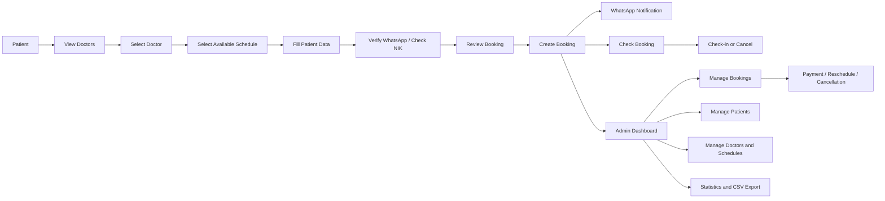

# Project Portfolio Documentation

---

# Bahasa Indonesia

## Nama Project

Cantika Dental Care / DentalClinic

---

## Deskripsi

Aplikasi web klinik gigi untuk membantu pasien melihat informasi layanan, memilih dokter, mengecek jadwal tersedia, dan membuat booking pemeriksaan gigi secara online. Project ini juga menyediakan halaman publik seperti home, about, services, daftar dokter, detail dokter, alur booking, halaman sukses booking, dan cek booking.

Untuk pihak klinik/admin, aplikasi menyediakan dashboard pengelolaan booking, pasien, dokter, jadwal praktik, pembayaran, check-in pasien, pembatalan, reschedule, notifikasi WhatsApp, dan statistik operasional.

---

## Masalah

Proses booking klinik gigi manual dapat menyebabkan jadwal bentrok, data pasien tersebar, proses konfirmasi kurang rapi, dan admin sulit memantau status booking, check-in, pembatalan, pembayaran, serta performa layanan dalam satu dashboard.

---

## Goals

Tujuan project ini adalah membangun sistem booking klinik gigi berbasis web yang memungkinkan pasien melakukan reservasi jadwal dokter secara mandiri, menerima notifikasi WhatsApp, mengecek status booking, melakukan check-in/cancel booking, serta membantu admin mengelola data booking, pasien, dokter, jadwal praktik, pembayaran, dan statistik klinik.

---

## Impact / Result

- Membangun alur booking online dari pemilihan dokter, pemilihan jadwal, pengisian data pasien, review, hingga halaman sukses booking.
- Mengurangi risiko jadwal bentrok melalui validasi slot dokter dan pengecekan booking aktif berdasarkan NIK.
- Memusatkan data pasien, dokter, jadwal, booking, pembayaran, check-in, pembatalan, dan reschedule dalam dashboard admin.
- Menyediakan notifikasi WhatsApp otomatis untuk verifikasi nomor, konfirmasi booking, reminder, check-in, pembatalan, dan reschedule melalui Fonnte API.
- Menyediakan statistik klinik seperti booking hari ini, check-in, cancellation, reschedule, revenue, top services, doctor bookings, dan export CSV.
- Memudahkan pasien mengecek booking menggunakan kode booking dan nomor WhatsApp.

---

## Fitur Utama

### Pasien / Public

- Melihat halaman home, about, services, dan daftar dokter.
- Melihat detail dokter dan jadwal tersedia.
- Memilih dokter, layanan, tanggal, dan jam booking.
- Mengisi data pasien, termasuk NIK, nama, nomor WhatsApp, tanggal lahir, gender, alamat, dan wilayah.
- Verifikasi WhatsApp melalui pesan otomatis.
- Cek NIK untuk mengambil data pasien lama dan mencegah booking aktif ganda.
- Membuat booking dan menerima kode booking.
- Melihat halaman sukses booking.
- Cek status booking dengan kode booking dan nomor WhatsApp.
- Check-in booking dengan kode booking.
- Membatalkan booking dengan alasan.

### Admin

- Login, register, reset password, verifikasi email, update password, dan profile management dari Laravel Breeze.
- Dashboard admin.
- Statistik booking dan revenue dengan filter all-time/monthly.
- Export statistik ke CSV.
- Manajemen booking: list, filter, detail, create, edit, reschedule, cancel.
- Input/update pembayaran booking dengan amount, payment method, dan note.
- Manajemen pasien: list, create, detail, edit, update.
- Check-in pasien dari dashboard admin.
- Manajemen dokter: list, detail, edit, update.
- Manajemen jadwal dokter: working period, time off, overtime, lock schedule, unlock schedule.
- Riwayat notifikasi per booking.

### Sistem / Otomasi

- Generate slot jadwal dokter berdasarkan working periods, time off, overtime, dan booking aktif.
- Reminder notification scheduler.
- Mark no-show scheduler.
- Queue jobs Laravel untuk proses background.
- Penyimpanan data wilayah Indonesia: provinces, cities, districts, villages.

---

## Teknologi

### Frontend

- React 18
- TypeScript
- Tailwind CSS
- Inertia.js React
- Headless UI
- Vite
- Axios
- Day.js
- SweetAlert2
- html-to-image
- Lodash

### Backend

- Laravel 12
- PHP 8.2+
- Inertia.js Laravel
- Laravel Breeze
- Laravel Sanctum
- Ziggy
- Laravel Queue / Jobs

### Database

- Database relational via Laravel migrations
- Tabel utama: users, patients, doctors, doctor_working_periods, doctor_time_off, doctor_overtimes, bookings, booking_payments, booking_checkins, booking_cancellations, booking_reschedules, notifications, provinces, cities, districts, villages, jobs, cache
- Jenis database spesifik: MySQL

### Testing / Quality

- Pest PHP
- Laravel Pint
- ESLint
- Prettier

### Deployment / Dev Tools

- Composer
- npm
- Vite build
- Laravel artisan serve
- Deployment configuration khusus: Tidak ditemukan di repository

---

## System Architecture

### Flow Sederhana

Pasien → Lihat Dokter → Pilih Dokter → Pilih Jadwal → Isi Data Pasien → Verifikasi WhatsApp / Cek NIK → Review Booking → Buat Booking → Sistem Kirim WhatsApp → Pasien Cek Booking / Check-in / Cancel → Admin Kelola Booking → Admin Input Pembayaran / Reschedule / Cancel → Dashboard Statistik

### Diagram Mermaid



---

## Struktur Repository

```text
app/
  Http/Controllers/
    Admin/
    Auth/
    Patients/
  Http/Requests/
  Models/
  Services/
  Jobs/
  Console/Commands/
database/
  migrations/
  seeders/
  factories/
resources/
  js/
    Pages/
      admin/
      patient/
      Auth/
      Profile/
    Components/
    Layouts/
    context/
    data/
    lib/
    types/
  css/
  views/
routes/
  web.php
  auth.php
public/
  wilayah.sql
```

---

## Database Schema Ringkas

- `users`: data user admin/auth, termasuk `role`.
- `patients`: data pasien, NIK, kontak, gender, tanggal lahir, alamat, medical records.
- `doctors`: data dokter, SIP, pengalaman, foto profil, status aktif.
- `doctor_working_periods`: jadwal praktik rutin dokter.
- `doctor_time_off`: jadwal dokter tidak tersedia.
- `doctor_overtimes`: jadwal tambahan dokter.
- `bookings`: booking pasien dengan dokter, layanan, tipe, tanggal, jam, status, kode booking.
- `booking_payments`: pembayaran booking.
- `booking_checkins`: data check-in booking.
- `booking_cancellations`: data pembatalan booking.
- `booking_reschedules`: riwayat dan status reschedule booking.
- `notifications`: log notifikasi WhatsApp dan status pengiriman.
- `provinces`, `cities`, `districts`, `villages`: data wilayah.

---

## Authentication & Authorization

Aplikasi memakai Laravel Breeze untuk autentikasi: login, register, forgot password, reset password, email verification, password update, logout, dan profile management. Route admin memakai middleware `auth`. Field `role` ditemukan pada model dan migration `users`, tetapi detail middleware role khusus tidak ditemukan di repository.

---

## Integrasi API

- API wilayah internal tersedia untuk lazy loading kota, kecamatan, dan desa:
  - `/api/provinces/{provinceId}/cities`
  - `/api/cities/{cityId}/districts`
  - `/api/districts/{districtId}/villages`

---

## Live Demo

https://klinik-gigi.iandev.my.id/

---

# English

## Project Name

Cantika Dental Care / DentalClinic

---

## Description

Web-based dental clinic application that helps patients browse services, choose doctors, check available schedules, and create dental appointment bookings online. Project also includes public pages such as home, about, services, doctor list, doctor detail, booking flow, booking success page, and booking lookup.

For clinic staff/admin, application provides dashboard modules for booking management, patient management, doctor management, practice schedules, payments, patient check-in, cancellations, rescheduling, WhatsApp notifications, and operational statistics.

---

## Problem

Manual dental clinic booking can cause schedule conflicts, scattered patient data, unstructured confirmations, and difficulty for admins to monitor booking status, check-ins, cancellations, payments, and service performance in one dashboard.

---

## Goals

Goal of this project is to build web-based dental clinic booking system that allows patients to reserve doctor schedules independently, receive WhatsApp notifications, check booking status, perform check-in/cancellation, and help admins manage bookings, patients, doctors, practice schedules, payments, and clinic statistics.

---

## Impact / Result

- Built online booking flow from doctor selection, schedule selection, patient data entry, review, to booking success page.
- Reduced schedule conflict risk through doctor slot validation and active booking checks by NIK.
- Centralized patient, doctor, schedule, booking, payment, check-in, cancellation, and reschedule data in admin dashboard.
- Added automated WhatsApp notifications for number verification, booking confirmation, reminder, check-in, cancellation, and reschedule using Fonnte API.
- Added clinic statistics such as today bookings, check-ins, cancellations, reschedules, revenue, top services, doctor bookings, and CSV export.
- Helped patients check bookings using booking code and WhatsApp number.

---

## Key Features

### Patient / Public

- View home, about, services, and doctor list pages.
- View doctor details and available schedules.
- Select doctor, service, date, and booking time.
- Fill patient data including NIK, name, WhatsApp number, birthdate, gender, address, and region.
- Verify WhatsApp through automated message.
- Check NIK to reuse existing patient data and prevent duplicate active booking.
- Create booking and receive booking code.
- View booking success page.
- Check booking status using booking code and WhatsApp number.
- Check in using booking code.
- Cancel booking with reason.

### Admin

- Login, register, reset password, email verification, password update, and profile management from Laravel Breeze.
- Admin dashboard.
- Booking and revenue statistics with all-time/monthly filters.
- Export statistics to CSV.
- Booking management: list, filter, detail, create, edit, reschedule, cancel.
- Create/update booking payment with amount, payment method, and note.
- Patient management: list, create, detail, edit, update.
- Patient check-in from admin dashboard.
- Doctor management: list, detail, edit, update.
- Doctor schedule management: working period, time off, overtime, lock schedule, unlock schedule.
- Notification history per booking.

### System / Automation

- Generate doctor schedule slots based on working periods, time off, overtime, and active bookings.
- Reminder notification scheduler.
- Mark no-show scheduler.
- Laravel queue jobs for background processing.
- Indonesian region data storage: provinces, cities, districts, villages.

---

## Technology

### Frontend

- React 18
- TypeScript
- Tailwind CSS
- Inertia.js React
- Headless UI
- Vite
- Axios
- Day.js
- SweetAlert2
- html-to-image
- Lodash

### Backend

- Laravel 12
- PHP 8.2+
- Inertia.js Laravel
- Laravel Breeze
- Laravel Sanctum
- Ziggy
- Laravel Queue / Jobs

### Database

- Relational database via Laravel migrations
- Main tables: users, patients, doctors, doctor_working_periods, doctor_time_off, doctor_overtimes, bookings, booking_payments, booking_checkins, booking_cancellations, booking_reschedules, notifications, provinces, cities, districts, villages, jobs, cache
- Specific database engine: Not found in the repository

### Integrations

- Fonnte API for WhatsApp notifications

### Testing / Quality

- Pest PHP
- Laravel Pint
- ESLint
- Prettier

### Deployment / Dev Tools

- Composer
- npm
- Vite build
- Laravel artisan serve
- Specific deployment configuration: Not found in the repository

---

## System Architecture

### Simple Flow

Patient → View Doctors → Select Doctor → Select Schedule → Fill Patient Data → Verify WhatsApp / Check NIK → Review Booking → Create Booking → System Sends WhatsApp → Patient Checks Booking / Check-in / Cancel → Admin Manages Booking → Admin Inputs Payment / Reschedules / Cancels → Statistics Dashboard

### Mermaid Diagram


---

## Repository Structure

```text
app/
  Http/Controllers/
    Admin/
    Auth/
    Patients/
  Http/Requests/
  Models/
  Services/
  Jobs/
  Console/Commands/
database/
  migrations/
  seeders/
  factories/
resources/
  js/
    Pages/
      admin/
      patient/
      Auth/
      Profile/
    Components/
    Layouts/
    context/
    data/
    lib/
    types/
  css/
  views/
routes/
  web.php
  auth.php
public/
  wilayah.sql
```

---

## Database Schema Summary

- `users`: admin/auth user data, including `role`.
- `patients`: patient data, NIK, contact, gender, birthdate, address, medical records.
- `doctors`: doctor data, SIP, experience, profile photo, active status.
- `doctor_working_periods`: recurring doctor practice schedules.
- `doctor_time_off`: unavailable doctor schedules.
- `doctor_overtimes`: additional doctor schedules.
- `bookings`: patient bookings with doctor, service, type, date, time, status, booking code.
- `booking_payments`: booking payment records.
- `booking_checkins`: booking check-in records.
- `booking_cancellations`: booking cancellation records.
- `booking_reschedules`: booking reschedule history and status.
- `notifications`: WhatsApp notification logs and delivery status.
- `provinces`, `cities`, `districts`, `villages`: region data.

---

## Authentication & Authorization

Application uses Laravel Breeze for authentication: login, register, forgot password, reset password, email verification, password update, logout, and profile management. Admin routes use `auth` middleware. `role` field exists in `users` model and migration, but dedicated role middleware details are not found in the repository.

---

## API Integrations

- Fonnte API sends WhatsApp messages through `https://api.fonnte.com/send`.
- Internal region APIs exist for lazy loading cities, districts, and villages:
  - `/api/provinces/{provinceId}/cities`
  - `/api/cities/{cityId}/districts`
  - `/api/districts/{districtId}/villages`
- Payment gateway: Not found in the repository.
- Shipping integration: Not found in the repository.

---

## Live Demo

https://klinik-gigi.iandev.my.id/
