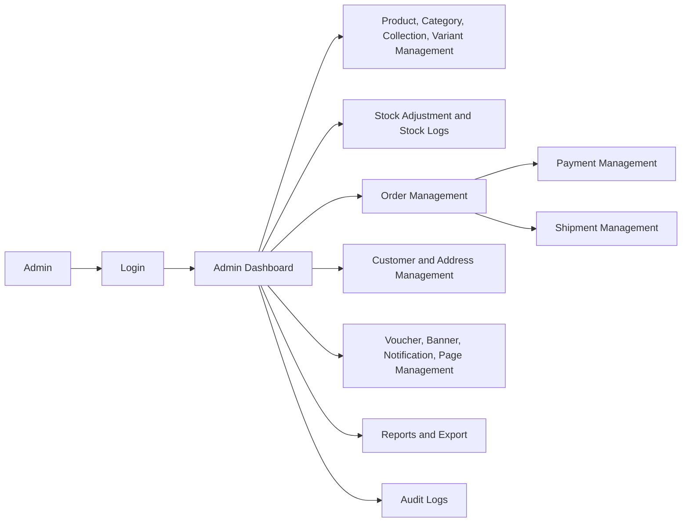

# Project Portfolio Documentation

---

# Bahasa Indonesia

## Nama Project

Shayda Fashion E-Commerce

---

## Deskripsi

Shayda Fashion E-Commerce adalah aplikasi web e-commerce fashion berbasis Laravel, Inertia, dan React. Aplikasi ini digunakan oleh pelanggan untuk melihat katalog produk, mengelola keranjang, checkout, memilih pengiriman, melakukan pembayaran, dan memantau pesanan.

Sistem ini juga menyediakan dashboard admin untuk mengelola produk, kategori, koleksi, varian, stok, pesanan, pembayaran, pengiriman, voucher, banner, halaman konten, notifikasi, customer, admin user, laporan, dan audit log.

Live Demo: https://shayda.webcareproject.my.id/

---

## Masalah

Penjualan fashion online membutuhkan sistem yang mampu mengelola katalog produk, variasi ukuran/warna, stok, transaksi, pembayaran, pengiriman, dan data pelanggan secara terpusat. Tanpa sistem terintegrasi, proses checkout, update stok, monitoring pembayaran, dan pelacakan pesanan lebih rentan tidak konsisten serta sulit dipantau admin.

---

## Goals

Tujuan project ini adalah membangun platform e-commerce fashion yang mendukung alur belanja pelanggan dari browsing produk hingga checkout, pembayaran, dan pengiriman, sekaligus menyediakan dashboard admin untuk mengelola operasional toko, katalog, stok, order, pembayaran, pengiriman, promosi, konten, dan laporan.

---

## Impact / Result

- Membangun alur belanja online dari katalog produk, detail produk, wishlist, cart, checkout, voucher, hingga order.
- Menyediakan dashboard admin untuk manajemen katalog, kategori, koleksi, varian produk, stok, customer, order, pembayaran, dan shipment.
- Mengintegrasikan layanan pembayaran Midtrans melalui service, webhook, payment log, dan sinkronisasi status pembayaran.
- Mengintegrasikan layanan pengiriman Biteship untuk pencarian area, shipping rate, shipment, tracking, webhook, dan webhook log.
- Menyediakan sistem stok dengan stock log, stock adjustment, reservasi stok, finalisasi stok, dan release stock reservation.
- Menyediakan fitur notifikasi pelanggan dan admin notification management.
- Menyediakan laporan admin untuk sales, products, customers, shipments, dan vouchers dengan fitur export.
- Menyediakan audit log aktivitas admin melalui middleware `admin.activity` dan model `AdminActivityLog`.

---

## Fitur Utama

### Pelanggan

- Registrasi, login, verifikasi email, reset password, konfirmasi password, dan two-factor challenge melalui Laravel Fortify.
- Login Google melalui Laravel Socialite (`/auth/google`, `/auth/google/callback`).
- Melihat homepage toko.
- Melihat daftar produk (`/list`).
- Melihat detail produk (`/detail`).
- Mengelola profil pelanggan.
- Mengelola alamat pelanggan.
- Menambahkan varian produk ke cart.
- Mengubah jumlah item cart.
- Menghapus item cart.
- Checkout.
- Mengambil shipping rates.
- Memilih shipping rate.
- Menggunakan voucher.
- Menghapus voucher dari checkout.
- Membuat order.
- Melihat daftar order.
- Melihat detail order.
- Membatalkan order.
- Mengelola wishlist.
- Melihat notifikasi.
- Menandai notifikasi sebagai dibaca.
- Membaca halaman kebijakan: privacy policy, no return policy, shipping policy, terms & conditions.

### Admin

- Login admin dengan redirect dashboard berdasarkan role.
- Dashboard admin.
- Manajemen produk: index, create, show, edit, update, publish, archive, duplicate, delete.
- Manajemen varian produk.
- Stock adjustment dan stock logs.
- Manajemen kategori.
- Manajemen koleksi.
- Manajemen order dan update status order.
- Catatan order admin.
- Membuat shipment dari order.
- Manajemen pembayaran dan sinkronisasi payment status.
- Payment logs.
- Manajemen shipment, update status shipment, dan refresh tracking.
- Biteship webhook logs.
- Manajemen customer dan toggle active customer.
- Manajemen customer address.
- Manajemen voucher.
- Manajemen notifikasi admin ke customer.
- Wishlist insight.
- Manajemen banner.
- Manajemen halaman konten.
- Manajemen store settings, contact settings, payment settings, dan shipping settings.
- Manajemen admin users.
- Laporan sales, products, customers, shipments, dan vouchers.
- Export laporan.
- Audit logs.

---

## Teknologi

### Frontend

- React 19
- TypeScript
- Inertia.js React
- Tailwind CSS 4
- Vite
- Radix UI
- Headless UI
- Lucide React
- Recharts
- React Leaflet / Leaflet
- TipTap editor
- Sonner

### Backend

- Laravel 13
- PHP 8.3+
- Inertia Laravel
- Laravel Fortify
- Laravel Sanctum
- Laravel Socialite
- Laravel Wayfinder
- Queue / Jobs Laravel

### Database

- SQLite pada `.env.example` (`DB_CONNECTION=sqlite`)
- Struktur database melalui Laravel migrations

### Integrasi

- Midtrans payment integration
- Biteship shipping integration
- Google OAuth login

### Testing & Quality Tools

- Pest PHP
- Laravel Pint
- ESLint
- Prettier
- TypeScript type check

### Tools / Others

- Composer
- npm
- GitHub

---

## System Architecture

### Flow Sederhana

Customer → Login/Register atau Google Login → Browse Product → Product Detail → Wishlist / Add to Cart → Manage Cart → Checkout → Select Address → Get Shipping Rate via Biteship → Apply Voucher → Place Order → Payment via Midtrans → Midtrans Webhook / Sync Payment → Admin Manage Order → Create Shipment via Biteship → Tracking / Shipment Status → Customer Order Detail / Notification

### Diagram Mermaid

```mermaid
flowchart LR
    A[Customer] --> B[Login / Register / Google Login]
    B --> C[Browse Product Catalog]
    C --> D[Product Detail]
    D --> E[Wishlist or Add to Cart]
    E --> F[Cart]
    F --> G[Checkout]
    G --> H[Select Address]
    H --> I[Biteship Shipping Rates]
    I --> J[Apply Voucher]
    J --> K[Place Order]
    K --> L[Midtrans Payment]
    L --> M[Payment Webhook / Sync]
    M --> N[Admin Order Management]
    N --> O[Biteship Shipment]
    O --> P[Tracking / Shipment Status]
    P --> Q[Customer Notification]
```

### Admin Flow

Admin → Login → Admin Dashboard → Manage Catalog / Stock / Orders / Payments / Shipments / Customers / Promotions / Content / Reports → Audit Log

---

## Struktur Folder Penting

- `app/Http/Controllers/Admin` — controller dashboard dan modul admin.
- `app/Http/Controllers/Customer` — controller fitur customer.
- `app/Models` — model utama seperti Product, ProductVariant, Cart, Order, Payment, Shipment, Voucher, Wishlist, Notification, dan User.
- `app/Services` — business logic admin, customer, stock, notification, settings, Midtrans, dan Biteship.
- `app/Actions` — action untuk payment sync, stock reservation, voucher reservation, dan Fortify user actions.
- `app/Jobs` — background job, termasuk sync expired Midtrans payments.
- `app/Http/Middleware` — middleware admin dan activity log.
- `database/migrations` — schema database.
- `database/seeders` — seed data awal seperti site settings dan pages.
- `resources/js/pages/customer` — halaman frontend customer.
- `resources/js/pages/admin` — halaman frontend admin.
- `resources/js/components` — komponen UI.
- `resources/js/layouts` — layout aplikasi, auth, profile, dan shop.
- `routes/web.php` — route web customer dan admin.
- `routes/api.php` — route API webhook Midtrans dan Biteship.
- `routes/settings.php` — route settings user.

---

## Database / Entity Utama

Berdasarkan model dan migration, entity utama yang ditemukan:

- User
- CustomerAddress
- Category
- Collection
- Product
- ProductImage
- ProductVariant
- StockLog
- Cart
- CartItem
- Voucher
- Order
- OrderItem
- OrderAddress
- Payment
- PaymentLog
- Shipment
- ShipmentTracking
- BiteshipWebhookLog
- Notification
- Wishlist
- Banner
- Page
- SiteSetting
- AdminActivityLog
- PersonalAccessToken

---

## Authentication & Authorization

- Authentication menggunakan Laravel Fortify.
- Two-factor authentication tersedia melalui Fortify pages dan migration two-factor columns.
- Role user menggunakan nilai `admin` dan `customer`.
- Admin route dilindungi middleware `auth`, `admin`, dan `admin.activity`.
- Customer route penting dilindungi middleware `auth` dan `verified`.
- Google OAuth login tersedia melalui Laravel Socialite.
- API `/user` menggunakan middleware `auth:sanctum`.

---

## Payment, Shipping, dan API Integration

### Midtrans

Ditemukan di repository.

- `app/Services/Integrations/MidtransService.php`
- `app/Services/Customer/MidtransWebhookService.php`
- `app/Actions/Payments/ApplyMidtransPaymentStatusAction.php`
- `app/Actions/Payments/SyncMidtransPaymentAction.php`
- `app/Actions/Payments/SyncExpiredMidtransPaymentsAction.php`
- `app/Jobs/Payments/SyncExpiredMidtransPaymentsJob.php`
- API webhook: `POST /api/payments/midtrans/notification`
- Env keys: `MIDTRANS_SERVER_KEY`, `MIDTRANS_CLIENT_KEY`

### Biteship

Ditemukan di repository.

- `app/Services/Integrations/BiteshipService.php`
- `app/Http/Controllers/Customer/BiteshipAreaController.php`
- `app/Http/Controllers/Customer/BiteshipWebhookController.php`
- Admin shipment management dan Biteship webhook logs.
- API webhook: `POST /api/shipments/biteship/webhook`
- Env key: `BITESHIP_API_KEY`

---

## Deployment Configuration

Tidak ditemukan di repository.

Repository memiliki script setup dan dev pada `composer.json`, script build/dev pada `package.json`, serta konfigurasi Vite. File deployment khusus seperti Dockerfile, docker-compose, GitHub Actions workflow, atau konfigurasi server production tidak ditemukan dari hasil inspeksi file utama.

---

## Informasi Tidak Ditemukan

- README.md: Tidak ditemukan di repository.
- requirements.txt: Tidak ditemukan di repository.
- Dokumentasi deployment production: Tidak ditemukan di repository.
- Data bisnis nyata seperti jumlah user, revenue, conversion rate, atau metrik performa: Tidak ditemukan di repository.

---

# English

## Project Name

Shayda Fashion E-Commerce

---

## Description

Shayda Fashion E-Commerce is a fashion e-commerce web application built with Laravel, Inertia, and React. Customers use it to browse products, manage carts, checkout, select shipping, complete payment, and track orders.

The system also provides an admin dashboard for managing products, categories, collections, variants, stock, orders, payments, shipments, vouchers, banners, content pages, notifications, customers, admin users, reports, and audit logs.

Live Demo: https://shayda.webcareproject.my.id/

---

## Problem

Online fashion sales need a system that can centrally manage product catalogs, size/color variants, inventory, transactions, payments, shipping, and customer data. Without an integrated system, checkout flow, stock updates, payment monitoring, and order tracking become harder to keep consistent and harder for admins to monitor.

---

## Goals

The goal of this project is to build a fashion e-commerce platform that supports customer shopping flows from product browsing to checkout, payment, and shipping, while providing an admin dashboard for store operations, catalog management, stock control, orders, payments, shipping, promotions, content, and reports.

---

## Impact / Result

- Built an online shopping flow from product catalog, product detail, wishlist, cart, checkout, voucher, to order creation.
- Provided an admin dashboard for catalog, category, collection, product variant, stock, customer, order, payment, and shipment management.
- Integrated Midtrans payment through service layer, webhook, payment logs, and payment status synchronization.
- Integrated Biteship shipping for area lookup, shipping rates, shipment creation, tracking, webhook, and webhook logs.
- Added inventory management through stock logs, stock adjustment, stock reservation, stock finalization, and stock reservation release.
- Added customer notifications and admin notification management.
- Added admin reports for sales, products, customers, shipments, and vouchers with export support.
- Added admin activity audit logs through `admin.activity` middleware and `AdminActivityLog` model.

---

## Main Features

### Customer

- Registration, login, email verification, password reset, password confirmation, and two-factor challenge through Laravel Fortify.
- Google login through Laravel Socialite (`/auth/google`, `/auth/google/callback`).
- View store homepage.
- View product list (`/list`).
- View product detail (`/detail`).
- Manage customer profile.
- Manage customer addresses.
- Add product variants to cart.
- Update cart item quantity.
- Remove cart items.
- Checkout.
- Fetch shipping rates.
- Select shipping rate.
- Apply voucher.
- Remove voucher from checkout.
- Place order.
- View order list.
- View order detail.
- Cancel order.
- Manage wishlist.
- View notifications.
- Mark notifications as read.
- Read policy pages: privacy policy, no return policy, shipping policy, terms & conditions.

### Admin

- Admin login with role-based dashboard redirect.
- Admin dashboard.
- Product management: index, create, show, edit, update, publish, archive, duplicate, delete.
- Product variant management.
- Stock adjustment and stock logs.
- Category management.
- Collection management.
- Order management and order status update.
- Admin order notes.
- Create shipment from order.
- Payment management and payment status sync.
- Payment logs.
- Shipment management, shipment status update, and tracking refresh.
- Biteship webhook logs.
- Customer management and customer active status toggle.
- Customer address management.
- Voucher management.
- Admin notification management for customers.
- Wishlist insight.
- Banner management.
- Content page management.
- Store settings, contact settings, payment settings, and shipping settings.
- Admin user management.
- Reports for sales, products, customers, shipments, and vouchers.
- Report export.
- Audit logs.

---

## Technologies

### Frontend

- React 19
- TypeScript
- Inertia.js React
- Tailwind CSS 4
- Vite
- Radix UI
- Headless UI
- Lucide React
- Recharts
- React Leaflet / Leaflet
- TipTap editor
- Sonner

### Backend

- Laravel 13
- PHP 8.3+
- Inertia Laravel
- Laravel Fortify
- Laravel Sanctum
- Laravel Socialite
- Laravel Wayfinder
- Laravel Queue / Jobs

### Database

- SQLite in `.env.example` (`DB_CONNECTION=sqlite`)
- Database structure through Laravel migrations

### Integrations

- Midtrans payment integration
- Biteship shipping integration
- Google OAuth login

### Testing & Quality Tools

- Pest PHP
- Laravel Pint
- ESLint
- Prettier
- TypeScript type check

### Tools / Others

- Composer
- npm
- GitHub

---

## System Architecture

### Simple Flow

Customer → Login/Register or Google Login → Browse Product → Product Detail → Wishlist / Add to Cart → Manage Cart → Checkout → Select Address → Get Shipping Rate via Biteship → Apply Voucher → Place Order → Payment via Midtrans → Midtrans Webhook / Sync Payment → Admin Manage Order → Create Shipment via Biteship → Tracking / Shipment Status → Customer Order Detail / Notification

### Mermaid Diagram

### Admin Flow

Admin → Login → Admin Dashboard → Manage Catalog / Stock / Orders / Payments / Shipments / Customers / Promotions / Content / Reports → Audit Log

---

## Important Folder Structure

- `app/Http/Controllers/Admin` — admin dashboard and module controllers.
- `app/Http/Controllers/Customer` — customer feature controllers.
- `app/Models` — main models such as Product, ProductVariant, Cart, Order, Payment, Shipment, Voucher, Wishlist, Notification, and User.
- `app/Services` — business logic for admin, customer, stock, notification, settings, Midtrans, and Biteship.
- `app/Actions` — actions for payment sync, stock reservation, voucher reservation, and Fortify user actions.
- `app/Jobs` — background jobs, including expired Midtrans payment synchronization.
- `app/Http/Middleware` — admin and activity log middleware.
- `database/migrations` — database schema.
- `database/seeders` — initial seed data such as site settings and pages.
- `resources/js/pages/customer` — customer frontend pages.
- `resources/js/pages/admin` — admin frontend pages.
- `resources/js/components` — UI components.
- `resources/js/layouts` — app, auth, profile, and shop layouts.
- `routes/web.php` — customer and admin web routes.
- `routes/api.php` — Midtrans and Biteship webhook API routes.
- `routes/settings.php` — user settings routes.

---

## Database / Main Entities

Based on models and migrations, main entities found:

- User
- CustomerAddress
- Category
- Collection
- Product
- ProductImage
- ProductVariant
- StockLog
- Cart
- CartItem
- Voucher
- Order
- OrderItem
- OrderAddress
- Payment
- PaymentLog
- Shipment
- ShipmentTracking
- BiteshipWebhookLog
- Notification
- Wishlist
- Banner
- Page
- SiteSetting
- AdminActivityLog
- PersonalAccessToken

---

## Authentication & Authorization

- Authentication uses Laravel Fortify.
- Two-factor authentication exists through Fortify pages and two-factor columns migration.
- User roles use `admin` and `customer` values.
- Admin routes are protected by `auth`, `admin`, and `admin.activity` middleware.
- Main customer routes are protected by `auth` and `verified` middleware.
- Google OAuth login exists through Laravel Socialite.
- API `/user` uses `auth:sanctum` middleware.

---

## Payment, Shipping, and API Integration

### Midtrans

Found in the repository.

- `app/Services/Integrations/MidtransService.php`
- `app/Services/Customer/MidtransWebhookService.php`
- `app/Actions/Payments/ApplyMidtransPaymentStatusAction.php`
- `app/Actions/Payments/SyncMidtransPaymentAction.php`
- `app/Actions/Payments/SyncExpiredMidtransPaymentsAction.php`
- `app/Jobs/Payments/SyncExpiredMidtransPaymentsJob.php`
- Webhook API: `POST /api/payments/midtrans/notification`
- Env keys: `MIDTRANS_SERVER_KEY`, `MIDTRANS_CLIENT_KEY`

### Biteship

Found in the repository.

- `app/Services/Integrations/BiteshipService.php`
- `app/Http/Controllers/Customer/BiteshipAreaController.php`
- `app/Http/Controllers/Customer/BiteshipWebhookController.php`
- Admin shipment management and Biteship webhook logs.
- Webhook API: `POST /api/shipments/biteship/webhook`
- Env key: `BITESHIP_API_KEY`

---

## Deployment Configuration

Not found in the repository.

The repository has setup and dev scripts in `composer.json`, build/dev scripts in `package.json`, and Vite configuration. Dedicated deployment files such as Dockerfile, docker-compose, GitHub Actions workflow, or production server configuration were not found during main file inspection.

---

## Information Not Found

- README.md: Not found in the repository.
- requirements.txt: Not found in the repository.
- Production deployment documentation: Not found in the repository.
- Real business data such as user count, revenue, conversion rate, or performance metrics: Not found in the repository.
