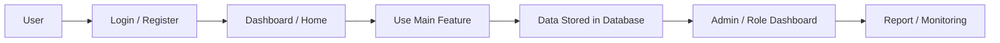

# Project Portfolio Documentation

---

# Bahasa Indonesia

## Nama Project

Aduan Emisi / Sobat Bumi

---

## Deskripsi

Aduan Emisi / Sobat Bumi adalah aplikasi web berbasis Laravel, Inertia, dan React untuk pelaporan isu lingkungan/emisi, edukasi, misi komunitas, donasi, quiz, leaderboard, dan reward. Aplikasi ini digunakan oleh warga/citizen, community, dan admin untuk mengelola laporan, partisipasi, konten, dan aktivitas berbasis poin.

Live Demo: https://sobatbumi.iandev.my.id/login

---

## Masalah

Pelaporan isu lingkungan sering tersebar, sulit diverifikasi, dan tidak terhubung dengan partisipasi komunitas. Sistem dibutuhkan untuk mengumpulkan laporan, komentar, volunteer, donasi, edukasi, dan reward dalam satu platform.

---

## Goals

Membangun platform partisipasi lingkungan yang memungkinkan warga membuat laporan, berdiskusi, berdonasi, mengikuti misi dan quiz, serta memudahkan admin mengelola laporan, user, konten, reward, dan sertifikat.

---

## Impact / Result

- Membangun alur pelaporan lingkungan dengan komentar dan media.
- Menyediakan sistem volunteer dan leader volunteer untuk laporan.
- Menyediakan modul donasi yang memakai Midtrans PHP dan payment callback.
- Menyediakan gamifikasi melalui point, badge, certificate, quiz, leaderboard, merchandise, dan redeem.
- Menyediakan dashboard admin untuk laporan, user, mission, quiz, content, badge, certificate, merchandise, dan redeem.

---

## Fitur Utama

### Citizen / Warga
- Registrasi, login, complete profile, dan Google login.
- Membuat laporan aduan/emisi dengan media.
- Melihat semua laporan, detail laporan, dan laporan milik sendiri.
- Update laporan melalui API.
- Komentar pada laporan.
- Mendaftar sebagai volunteer atau leader volunteer.
- Melihat peta laporan.
- Melihat konten edukasi.
- Mengikuti kuis, attempt quiz, dan melihat leaderboard.
- Donasi ke laporan dan callback pembayaran.
- Melihat merchandise dan redeem.
- Melihat notifikasi dan profil.

### Community
- Profil community.
- Fitur report, map, mission, content, comment, dan notification berdasarkan controller Community.

### Admin
- Dashboard admin.
- Manajemen laporan.
- Manajemen user.
- Manajemen mission.
- Manajemen quiz, question, answer, dan quiz attempt.
- Manajemen content dan content media.
- Manajemen merchandise dan redeem.
- Manajemen badge dan certificate.
- Report admin dan export PDF melalui Dompdf.

---

## Teknologi

### Frontend
- React 18
- TypeScript
- Inertia.js React
- Tailwind CSS
- Vite
- Radix UI
- React Leaflet / Leaflet
- React Query
- Recharts
- React Hook Form
- Zod
### Backend
- Laravel 12
- PHP 8.2+
- Laravel Breeze
- Laravel Sanctum
- Laravel Socialite
- Tighten Ziggy
- Laravel Telescope
- Dompdf
### Database
- Laravel migrations
- Database driver not specified in inspected summary
### Integrations
- Google OAuth
- Midtrans PHP
- Chatbot endpoint
### Tools / Others
- Composer
- npm
- Pest PHP
- Laravel Pint
- ESLint

---

## System Architecture

### Flow Sederhana

Citizen → Login/Register/Google Login → Complete Profile → Create Report → Comment / Volunteer / Donate → Admin Manage Report → Mission / Quiz / Reward → Leaderboard / Certificate

### Diagram Mermaid

---

## Struktur Folder Penting

- `app/Http/Controllers` — controller fitur utama dan role pengguna.
- `app/Models` — model entity database.
- `database/migrations` — schema database Laravel.
- `resources/js/pages` atau `resources/views` — halaman frontend.
- `routes/web.php` — route web utama.
- `routes/api.php` — route API jika tersedia.
- `composer.json` — dependency backend PHP/Laravel.
- `package.json` — dependency frontend dan build tool.

---

## Database / Entity Utama

- User
- Report
- ReportMedia
- ReportVote
- Comment
- Donation
- Mission
- MissionVolunteer
- MissionCommunity
- MissionDocumentation
- Quiz
- Question
- Answer
- QuizAttempt
- QuizAttemptAnswer
- Point
- Badge
- UserBadge
- Certificate
- UserCertificate
- Merchandise
- Reedems
- Content
- ContentMedia
- Community
- Notification
- Province
- City
- District

---

## Integrasi / API Eksternal

Google OAuth, Midtrans PHP, chatbot endpoint ditemukan di repository.

---

## Informasi Tidak Ditemukan

- requirements.txt: Tidak ditemukan di repository.
- Dokumentasi deployment production khusus: Tidak ditemukan di repository.
- Data bisnis nyata seperti jumlah user, revenue, conversion rate, atau metrik performa: Tidak ditemukan di repository.

---

# English

## Project Name

Aduan Emisi / Sobat Bumi

---

## Description

Aduan Emisi / Sobat Bumi is a Laravel, Inertia, and React web application for environmental/emission reporting, education, community missions, donations, quizzes, leaderboards, and rewards. It is used by citizens, communities, and admins to manage reports, participation, content, and point-based activities.

Live Demo: https://sobatbumi.iandev.my.id/login

---

## Problem

Environmental issue reporting is often fragmented, hard to verify, and disconnected from community participation. The system centralizes reports, comments, volunteers, donations, education, and rewards in one platform.

---

## Goals

Build an environmental participation platform where citizens can submit reports, discuss, donate, join missions and quizzes, while admins manage reports, users, content, rewards, and certificates.

---

## Impact / Result

- Built environmental report flow with comments and media.
- Added volunteer and leader volunteer registration for reports.
- Added donation module using Midtrans PHP and payment callback.
- Added gamification through points, badges, certificates, quizzes, leaderboard, merchandise, and redemption.
- Provided admin dashboard for reports, users, missions, quizzes, content, badges, certificates, merchandise, and redemptions.

---

## Main Features

### Citizen
- Registrasi, login, complete profile, dan Google login.
- Membuat laporan aduan/emisi dengan media.
- Melihat semua laporan, detail laporan, dan laporan milik sendiri.
- Update laporan melalui API.
- Komentar pada laporan.
- Mendaftar sebagai volunteer atau leader volunteer.
- Melihat peta laporan.
- Melihat konten edukasi.
- Mengikuti kuis, attempt quiz, dan melihat leaderboard.
- Donasi ke laporan dan callback pembayaran.
- Melihat merchandise dan redeem.
- Melihat notifikasi dan profil.

### Community
- Profil community.
- Fitur report, map, mission, content, comment, dan notification berdasarkan controller Community.

### Admin
- Dashboard admin.
- Manage laporan.
- Manage user.
- Manage mission.
- Manage quiz, question, answer, dan quiz attempt.
- Manage content dan content media.
- Manage merchandise dan redeem.
- Manage badge dan certificate.
- Report admin dan export PDF melalui Dompdf.

---

## Technologies

### Frontend
- React 18
- TypeScript
- Inertia.js React
- Tailwind CSS
- Vite
- Radix UI
- React Leaflet / Leaflet
- React Query
- Recharts
- React Hook Form
- Zod
### Backend
- Laravel 12
- PHP 8.2+
- Laravel Breeze
- Laravel Sanctum
- Laravel Socialite
- Tighten Ziggy
- Laravel Telescope
- Dompdf
### Database
- Laravel migrations
- Database driver not specified in inspected summary
### Integrations
- Google OAuth
- Midtrans PHP
- Chatbot endpoint
### Tools / Others
- Composer
- npm
- Pest PHP
- Laravel Pint
- ESLint

---

## System Architecture

### Simple Flow

Citizen → Login/Register/Google Login → Complete Profile → Create Report → Comment / Volunteer / Donate → Admin Manage Report → Mission / Quiz / Reward → Leaderboard / Certificate

### Mermaid Diagram

---

## Important Folder Structure

- `app/Http/Controllers` — main feature and user role controllers.
- `app/Models` — database entity models.
- `database/migrations` — Laravel database schema.
- `resources/js/pages` or `resources/views` — frontend pages.
- `routes/web.php` — main web routes.
- `routes/api.php` — API routes if available.
- `composer.json` — PHP/Laravel backend dependencies.
- `package.json` — frontend dependencies and build tools.

---

## Database / Main Entities

- User
- Report
- ReportMedia
- ReportVote
- Comment
- Donation
- Mission
- MissionVolunteer
- MissionCommunity
- MissionDocumentation
- Quiz
- Question
- Answer
- QuizAttempt
- QuizAttemptAnswer
- Point
- Badge
- UserBadge
- Certificate
- UserCertificate
- Merchandise
- Reedems
- Content
- ContentMedia
- Community
- Notification
- Province
- City
- District

---

## External Integrations / API

Google OAuth, Midtrans PHP, and chatbot endpoint were found in the repository.

---

## Information Not Found

- requirements.txt: Not found in the repository.
- Dedicated production deployment documentation: Not found in the repository.
- Real business data such as user count, revenue, conversion rate, or performance metrics: Not found in the repository.
