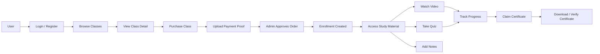

# Project Portfolio Documentation

---

# Bahasa Indonesia

## Nama Project

LMS Impact Academy

---

## Deskripsi

LMS Impact Academy adalah aplikasi learning management system berbasis Laravel, Inertia, dan React untuk menjual dan mengelola kelas online. Aplikasi digunakan oleh user/student dan admin untuk browsing kelas, pembelian kelas, akses materi belajar, video, kuis, progress belajar, catatan, review, dan sertifikat.

Admin dapat mengelola kelas, modul, video, kuis, mentor, kategori, order, user, dan dashboard. User dapat melihat kelas publik, membeli kelas dengan upload bukti pembayaran, mengikuti materi setelah akses disetujui, mengerjakan kuis, mencatat materi, melihat progress, memberi review, dan klaim/download sertifikat.

---

## Masalah

Pengelolaan kelas online secara manual menyulitkan admin dalam mengatur materi, video, kuis, mentor, order, akses peserta, dan sertifikat. Peserta juga membutuhkan alur belajar terpusat untuk membeli kelas, mengakses materi, menyimpan catatan, memantau progres, dan mendapatkan sertifikat.

---

## Goals

Tujuan project ini adalah membangun LMS online yang menyediakan katalog kelas, pembelian kelas, verifikasi order, akses belajar berbasis enrollment, video learning, quiz/pretest, progress tracking, notes, review kelas, dan penerbitan sertifikat.

---

## Impact / Result

- Membangun platform LMS dengan modul user dan admin.
- Menyediakan katalog kelas, detail kelas, dan purchase flow dengan upload bukti pembayaran.
- Mengamankan akses materi dengan middleware `has.course.access`.
- Menyediakan progress video, module progress, quiz attempt, quiz answer, dan review kelas.
- Menyediakan sistem sertifikat dengan claim, list, view, download, dan public verification.
- Menyediakan admin dashboard dengan chart data dan pengelolaan kelas, modul, kuis, mentor, kategori, order, dan user.
- Menyediakan PDF certificate generation melalui DomPDF.

---

## Fitur Utama

### User / Student

- Register, login, email verification, reset password, dan profile management.
- Melihat home, FAQ, privacy policy, terms and conditions, dan contact us.
- Melihat daftar kelas dan detail kelas.
- Membeli kelas dengan upload proof file/bukti pembayaran.
- Melihat order success, my order, dan my class.
- Mengakses materi setelah memiliki course access.
- Menonton video pembelajaran.
- Update progress video dan mark completed.
- Menambahkan, mengubah, dan menghapus catatan video.
- Mengerjakan quiz/pretest.
- Melihat hasil quiz.
- Memberikan review kelas.
- Melihat, klaim, view, download, dan verifikasi sertifikat.

### Admin

- Dashboard admin.
- Chart data dashboard.
- Manajemen kelas: list, create, detail, update, publish, review.
- Manajemen module: create, store, update.
- Manajemen quiz: create, store, get, update.
- Manajemen mentor: list, create, store, update.
- Manajemen kategori: list, create, store.
- Manajemen order: list, approve, reject/update status.
- Manajemen user.
- Profile admin.

### Sistem

- Middleware `isAdmin` untuk admin.
- Middleware `has.course.access` untuk akses materi belajar.
- Enrollment setelah order disetujui.
- Tracking progress video, module, quiz, dan certificate issuance.
- Certificate public verification.

---

## Teknologi

### Frontend

- React 18
- TypeScript
- Inertia.js React
- Tailwind CSS
- Vite
- Chart.js
- React Chart.js 2
- React Easy Crop
- React YouTube
- Axios
- Lodash

### Backend

- Laravel 12
- PHP 8.2+
- Inertia.js Laravel
- Laravel Breeze
- Laravel Sanctum
- Ziggy
- DomPDF
- Laravel Queue / Jobs

### Database

- Relational database via Laravel migrations
- Tabel utama: users, categories, mentors, classes, class_mentors, modules, videos, video_resources, video_notes, video_progress, module_progress, quizzes, quiz_questions, quiz_options, quiz_attempts, quiz_answers, class_orders, class_order_status_logs, enrollments, class_reviews, certificate_settings, certificate_issuances, jobs, cache
- Jenis database spesifik: Tidak ditemukan di repository

### Integrasi

- YouTube video embedding/player via `react-youtube`
- PDF certificate generation via `barryvdh/laravel-dompdf`
- Payment gateway: Tidak ditemukan di repository
- Upload bukti pembayaran manual ditemukan di order flow

### Testing / Quality

- Pest PHP
- Laravel Pint
- ESLint
- Prettier

### Deployment / Dev Tools

- Composer
- npm
- Vite build
- Laravel artisan serve
- Deployment configuration khusus: Tidak ditemukan di repository

---

## System Architecture

### Flow Sederhana

User → Login/Register → Browse Classes → View Class Detail → Purchase Class → Upload Payment Proof → Admin Approves Order → Enrollment Created → Access Study Material → Watch Video / Take Quiz / Add Notes → Track Progress → Claim Certificate → Download / Verify Certificate

### Diagram Mermaid



---

## Struktur Repository

```text
app/
  Http/Controllers/Admin
  Http/Controllers/User
  Http/Controllers/Auth
  Http/Middleware
  Http/Requests
  Models
  Services
database/
  migrations
  seeders
resources/
  js
    Pages
    Components
    Layouts
  views
routes/
  web.php
  auth.php
config/
```

---

## Database Schema Ringkas

- `users`: data peserta/admin, phone, company, position, dan role.
- `categories`: kategori kelas.
- `mentors`: data mentor.
- `classes`: data kelas.
- `class_mentors`: relasi kelas dan mentor.
- `modules`: modul kelas.
- `videos`: video pembelajaran dan YouTube URL.
- `video_resources`: resource/file pendukung video.
- `video_notes`: catatan user pada video.
- `video_progress`: progress menonton video.
- `module_progress`: progress modul.
- `quizzes`, `quiz_questions`, `quiz_options`, `quiz_attempts`, `quiz_answers`: sistem kuis dan jawaban.
- `class_orders`: order pembelian kelas dan proof URL.
- `class_order_status_logs`: log status order.
- `enrollments`: akses kelas user.
- `class_reviews`: review kelas.
- `certificate_settings`: template sertifikat.
- `certificate_issuances`: sertifikat yang diterbitkan.

---

## Authentication & Authorization

Aplikasi memakai Laravel Breeze untuk autentikasi. Admin routes memakai middleware `auth` dan `isAdmin`. Akses belajar memakai middleware `has.course.access`. User routes tertentu memakai middleware `auth`. Field `role` tersedia pada tabel `users`.

---

## Integrasi API

- YouTube digunakan untuk video pembelajaran melalui `react-youtube`.
- DomPDF digunakan untuk generate/download sertifikat PDF.
- Payment gateway: Tidak ditemukan di repository.
- Shipping integration: Tidak ditemukan di repository.

---

## Live Demo

https://lms.iandev.my.id/home

---

# English

## Project Name

LMS Impact Academy

---

## Description

LMS Impact Academy is a learning management system built with Laravel, Inertia, and React for selling and managing online classes. Application is used by users/students and admins for class browsing, class purchase, learning access, videos, quizzes, learning progress, notes, reviews, and certificates.

Admins can manage classes, modules, videos, quizzes, mentors, categories, orders, users, and dashboard. Users can browse public classes, purchase classes by uploading payment proof, access materials after approval, take quizzes, write notes, track progress, submit reviews, and claim/download certificates.

---

## Problem

Manual online class management makes it difficult for admins to organize materials, videos, quizzes, mentors, orders, participant access, and certificates. Students also need centralized learning flow to buy classes, access materials, save notes, track progress, and receive certificates.

---

## Goals

Goal of this project is to build online LMS that provides class catalog, class purchase, order verification, enrollment-based learning access, video learning, quiz/pretest, progress tracking, notes, class reviews, and certificate issuance.

---

## Impact / Result

- Built LMS platform with user and admin modules.
- Provided class catalog, class details, and purchase flow with payment proof upload.
- Secured learning material access with `has.course.access` middleware.
- Added video progress, module progress, quiz attempt, quiz answer, and class review features.
- Added certificate system with claim, list, view, download, and public verification.
- Added admin dashboard with chart data and management for classes, modules, quizzes, mentors, categories, orders, and users.
- Provided PDF certificate generation through DomPDF.

---

## Key Features

### User / Student

- Register, login, email verification, reset password, and profile management.
- View home, FAQ, privacy policy, terms and conditions, and contact us.
- View class list and class details.
- Purchase class by uploading proof file/payment proof.
- View order success, my order, and my class.
- Access materials after course access is granted.
- Watch learning videos.
- Update video progress and mark completed.
- Add, update, and delete video notes.
- Take quiz/pretest.
- View quiz result.
- Submit class review.
- View, claim, view, download, and verify certificates.

### Admin

- Admin dashboard.
- Dashboard chart data.
- Class management: list, create, detail, update, publish, review.
- Module management: create, store, update.
- Quiz management: create, store, get, update.
- Mentor management: list, create, store, update.
- Category management: list, create, store.
- Order management: list, approve, reject/update status.
- User management.
- Admin profile.

### System

- `isAdmin` middleware for admin.
- `has.course.access` middleware for learning material access.
- Enrollment after order approval.
- Video, module, quiz, and certificate issuance progress tracking.
- Certificate public verification.

---

## Technology

### Frontend

- React 18
- TypeScript
- Inertia.js React
- Tailwind CSS
- Vite
- Chart.js
- React Chart.js 2
- React Easy Crop
- React YouTube
- Axios
- Lodash

### Backend

- Laravel 12
- PHP 8.2+
- Inertia.js Laravel
- Laravel Breeze
- Laravel Sanctum
- Ziggy
- DomPDF
- Laravel Queue / Jobs

### Database

- Relational database via Laravel migrations
- Main tables: users, categories, mentors, classes, class_mentors, modules, videos, video_resources, video_notes, video_progress, module_progress, quizzes, quiz_questions, quiz_options, quiz_attempts, quiz_answers, class_orders, class_order_status_logs, enrollments, class_reviews, certificate_settings, certificate_issuances, jobs, cache
- Specific database engine: Not found in the repository

### Integrations

- YouTube video embedding/player via `react-youtube`
- PDF certificate generation via `barryvdh/laravel-dompdf`
- Payment gateway: Not found in the repository
- Manual payment proof upload found in order flow

### Testing / Quality

- Pest PHP
- Laravel Pint
- ESLint
- Prettier

### Deployment / Dev Tools

- Composer
- npm
- Vite build
- Laravel artisan serve
- Specific deployment configuration: Not found in the repository

---

## System Architecture

### Simple Flow

User → Login/Register → Browse Classes → View Class Detail → Purchase Class → Upload Payment Proof → Admin Approves Order → Enrollment Created → Access Study Material → Watch Video / Take Quiz / Add Notes → Track Progress → Claim Certificate → Download / Verify Certificate

### Mermaid Diagram


---

## Repository Structure

```text
app/
  Http/Controllers/Admin
  Http/Controllers/User
  Http/Controllers/Auth
  Http/Middleware
  Http/Requests
  Models
  Services
database/
  migrations
  seeders
resources/
  js
    Pages
    Components
    Layouts
  views
routes/
  web.php
  auth.php
config/
```

---

## Database Schema Summary

- `users`: student/admin data, phone, company, position, and role.
- `categories`: class categories.
- `mentors`: mentor data.
- `classes`: class data.
- `class_mentors`: class and mentor relation.
- `modules`: class modules.
- `videos`: learning videos and YouTube URL.
- `video_resources`: supporting video resources/files.
- `video_notes`: user notes on videos.
- `video_progress`: video watching progress.
- `module_progress`: module progress.
- `quizzes`, `quiz_questions`, `quiz_options`, `quiz_attempts`, `quiz_answers`: quiz and answer system.
- `class_orders`: class purchase orders and proof URL.
- `class_order_status_logs`: order status logs.
- `enrollments`: user class access.
- `class_reviews`: class reviews.
- `certificate_settings`: certificate template.
- `certificate_issuances`: issued certificates.

---

## Authentication & Authorization

Application uses Laravel Breeze for authentication. Admin routes use `auth` and `isAdmin` middleware. Learning access uses `has.course.access` middleware. Some user routes use `auth` middleware. `role` field exists in `users` table.

---

## API Integrations

- YouTube is used for learning videos through `react-youtube`.
- DomPDF is used to generate/download PDF certificates.
- Payment gateway: Not found in the repository.
- Shipping integration: Not found in the repository.

---

## Live Demo

https://lms.iandev.my.id/home
