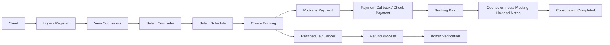

# Project Portfolio Documentation

---

# Bahasa Indonesia

## Nama Project

Persona Quality

---

## Deskripsi

Persona Quality adalah aplikasi konsultasi online berbasis Laravel, Inertia, dan React untuk menghubungkan client dengan counselor. Aplikasi digunakan oleh client, counselor, dan admin untuk mengelola booking konsultasi, jadwal counselor, pembayaran, refund, reschedule, dan catatan sesi.

Client dapat melihat daftar counselor, memilih jadwal, membuat booking, membayar konsultasi melalui Midtrans, melihat riwayat booking, melakukan reschedule/cancel, dan mengelola profil. Counselor dapat mengelola profil, melihat jadwal kerja, menerima/menangani booking, memasukkan meeting link dan catatan, serta menyelesaikan sesi. Admin mengelola counselor, workday, booking, client, refund, dan dashboard.

---

## Masalah

Proses konsultasi manual sering menyulitkan client dalam menemukan counselor, mengecek jadwal tersedia, melakukan pembayaran, dan memantau status konsultasi. Di sisi operasional, admin dan counselor membutuhkan sistem terpusat untuk mengelola jadwal, booking, reschedule, refund, meeting link, dan catatan sesi.

---

## Goals

Tujuan project ini adalah membangun platform konsultasi online yang memungkinkan client memilih counselor dan jadwal, membuat booking, membayar secara online, mengatur ulang jadwal, membatalkan booking, serta membantu counselor dan admin mengelola operasional konsultasi secara terstruktur.

---

## Impact / Result

- Membangun alur konsultasi online dari pemilihan counselor, pemilihan jadwal, booking, pembayaran, hingga detail booking.
- Mengintegrasikan Midtrans untuk pembayaran, status check, dan callback pembayaran.
- Menyediakan manajemen jadwal counselor melalui workday dan schedule.
- Menyediakan fitur reschedule, cancellation, refund status, meeting link, counselor notes, dan session logs.
- Memisahkan role dan dashboard untuk client, counselor, dan admin.
- Menyediakan admin module untuk counselor, client, booking, workday, refund, dan dashboard.

---

## Fitur Utama

### Client

- Register, login, email verification, reset password, dan profile management.
- Dashboard client.
- Melihat daftar counselor dan detail counselor.
- Memilih jadwal counselor.
- Membuat booking konsultasi.
- Memilih tipe konsultasi.
- Melihat detail booking dan riwayat booking.
- Melakukan pembayaran melalui Midtrans.
- Mengecek status pembayaran.
- Mengajukan reschedule booking.
- Membatalkan booking.
- Melihat FAQ.

### Counselor

- Dashboard counselor.
- Mengelola profil counselor.
- Melihat workday schedule.
- Melihat daftar dan detail booking.
- Mengubah status reschedule.
- Mengisi meeting link dan notes.
- Menyelesaikan booking.

### Admin

- Dashboard admin.
- CRUD counselor.
- CRUD counselor workday.
- CRUD booking.
- CRUD refund.
- Approve/update status refund.
- CRUD client.

### Sistem

- Role middleware untuk `admin`, `counselor`, dan `client`.
- Generate/kelola schedule berbasis counselor workday.
- Payment status mapping untuk `capture`, `settlement`, `pending`, `deny`, `cancel`, `expire`, dan `refund`.
- Release schedule ketika payment expired.

---

## Teknologi

### Frontend

- React 18
- TypeScript
- Inertia.js React
- Tailwind CSS
- Vite
- Radix UI components
- TanStack React Query
- React Hook Form
- Recharts
- jsPDF
- html2canvas
- Axios
- Lucide React

### Backend

- Laravel 12
- PHP 8.2+
- Inertia.js Laravel
- Laravel Breeze
- Laravel Sanctum
- Ziggy
- Laravel Queue / Jobs

### Database

- Relational database via Laravel migrations
- Tabel utama: users, counselors, counselors_work_days, schedules, bookings, payments, session_logs, admin_settings, personal_access_tokens, jobs, cache
- Jenis database spesifik: Tidak ditemukan di repository

### Integrasi

- Midtrans payment gateway
- Midtrans callback endpoint: `/api/midtrans/callback`

### Testing / Quality

- Pest PHP
- Laravel Pint
- ESLint
- Prettier

### Deployment / Dev Tools

- Composer
- npm
- Vite build
- Laravel artisan serve
- Deployment configuration khusus: Tidak ditemukan di repository

---

## System Architecture

### Flow Sederhana

Client → Login/Register → Lihat Counselor → Pilih Counselor → Pilih Jadwal → Buat Booking → Midtrans Payment → Payment Callback / Check Payment → Booking Paid → Counselor Input Meeting Link & Notes → Consultation Completed → Admin Monitor Booking & Refund

### Diagram Mermaid



---

## Struktur Repository

```text
app/
  Http/Controllers/Admin
  Http/Controllers/Client
  Http/Controllers/Counselor
  Http/Controllers/Auth
  Http/Middleware
  Http/Requests
  Models
  Services
  Console/Commands
database/
  migrations
  seeders
resources/
  js
    Pages
    Components
    Layouts
  views
routes/
  web.php
  api.php
  auth.php
config/
```

---

## Database Schema Ringkas

- `users`: data user, email, phone, profile picture, dan role.
- `counselors`: data counselor, education, specialization, description, price, online price, dan status.
- `counselors_work_days`: jadwal kerja rutin counselor.
- `schedules`: slot jadwal counselor dengan date, start_time, end_time, dan availability.
- `bookings`: data booking client-counselor, schedule, reschedule, consultation type, meeting link, status, notes, cancellation, refund, dan expired flag.
- `payments`: data pembayaran Midtrans, snap token, payment URL, VA number, status, refund, paid time, dan expiry time.
- `session_logs`: catatan sesi dan status sesi.
- `admin_settings`: key-value setting admin.

---

## Authentication & Authorization

Aplikasi memakai Laravel Breeze untuk autentikasi. Route admin memakai middleware `auth` dan `role:admin`. Route counselor memakai `role:counselor,admin`. Route client memakai `role:client` dan `verified`. Field `role` tersedia pada tabel `users`.

---

## Integrasi API

- Midtrans digunakan untuk membuat pembayaran, mengecek status transaksi, dan menerima callback pembayaran.
- Endpoint callback: `/api/midtrans/callback`.
- Payment gateway lain: Tidak ditemukan di repository.
- Shipping integration: Tidak ditemukan di repository.

---

## Live Demo

https://consul.iandev.my.id/login

---

# English

## Project Name

Persona Quality

---

## Description

Persona Quality is an online consultation application built with Laravel, Inertia, and React to connect clients with counselors. Application is used by clients, counselors, and admins to manage consultation bookings, counselor schedules, payments, refunds, reschedules, and session notes.

Clients can browse counselors, select schedules, create bookings, pay consultations through Midtrans, view booking history, reschedule/cancel bookings, and manage profiles. Counselors can manage profiles, view work schedules, handle bookings, input meeting links and notes, and complete sessions. Admins manage counselors, workdays, bookings, clients, refunds, and dashboard.

---

## Problem

Manual consultation processes make it difficult for clients to find counselors, check available schedules, pay online, and monitor consultation status. Operationally, admins and counselors need centralized system to manage schedules, bookings, reschedules, refunds, meeting links, and session notes.

---

## Goals

Goal of this project is to build online consultation platform that lets clients choose counselors and schedules, create bookings, pay online, reschedule, cancel bookings, and help counselors/admins manage consultation operations in structured way.

---

## Impact / Result

- Built online consultation flow from counselor selection, schedule selection, booking, payment, to booking detail.
- Integrated Midtrans for payment, status check, and payment callback.
- Provided counselor schedule management through workdays and schedules.
- Added reschedule, cancellation, refund status, meeting link, counselor notes, and session logs.
- Separated roles and dashboards for client, counselor, and admin.
- Provided admin modules for counselors, clients, bookings, workdays, refunds, and dashboard.

---

## Key Features

### Client

- Register, login, email verification, reset password, and profile management.
- Client dashboard.
- View counselor list and counselor details.
- Select counselor schedule.
- Create consultation booking.
- Select consultation type.
- View booking detail and booking history.
- Pay through Midtrans.
- Check payment status.
- Request booking reschedule.
- Cancel booking.
- View FAQ.

### Counselor

- Counselor dashboard.
- Manage counselor profile.
- View workday schedule.
- View booking list and booking detail.
- Change reschedule status.
- Input meeting link and notes.
- Complete booking.

### Admin

- Admin dashboard.
- CRUD counselors.
- CRUD counselor workdays.
- CRUD bookings.
- CRUD refunds.
- Approve/update refund status.
- CRUD clients.

### System

- Role middleware for `admin`, `counselor`, and `client`.
- Generate/manage schedules based on counselor workdays.
- Payment status mapping for `capture`, `settlement`, `pending`, `deny`, `cancel`, `expire`, and `refund`.
- Release schedule when payment expires.

---

## Technology

### Frontend

- React 18
- TypeScript
- Inertia.js React
- Tailwind CSS
- Vite
- Radix UI components
- TanStack React Query
- React Hook Form
- Recharts
- jsPDF
- html2canvas
- Axios
- Lucide React

### Backend

- Laravel 12
- PHP 8.2+
- Inertia.js Laravel
- Laravel Breeze
- Laravel Sanctum
- Ziggy
- Laravel Queue / Jobs

### Database

- Relational database via Laravel migrations
- Main tables: users, counselors, counselors_work_days, schedules, bookings, payments, session_logs, admin_settings, personal_access_tokens, jobs, cache
- Specific database engine: Not found in the repository

### Integrations

- Midtrans payment gateway
- Midtrans callback endpoint: `/api/midtrans/callback`

### Testing / Quality

- Pest PHP
- Laravel Pint
- ESLint
- Prettier

### Deployment / Dev Tools

- Composer
- npm
- Vite build
- Laravel artisan serve
- Specific deployment configuration: Not found in the repository

---

## System Architecture

### Simple Flow

Client → Login/Register → View Counselors → Select Counselor → Select Schedule → Create Booking → Midtrans Payment → Payment Callback / Check Payment → Booking Paid → Counselor Inputs Meeting Link & Notes → Consultation Completed → Admin Monitor Booking & Refund

### Mermaid Diagram


---

## Repository Structure

```text
app/
  Http/Controllers/Admin
  Http/Controllers/Client
  Http/Controllers/Counselor
  Http/Controllers/Auth
  Http/Middleware
  Http/Requests
  Models
  Services
  Console/Commands
database/
  migrations
  seeders
resources/
  js
    Pages
    Components
    Layouts
  views
routes/
  web.php
  api.php
  auth.php
config/
```

---

## Database Schema Summary

- `users`: user data, email, phone, profile picture, and role.
- `counselors`: counselor data, education, specialization, description, price, online price, and status.
- `counselors_work_days`: recurring counselor work schedules.
- `schedules`: counselor schedule slots with date, start_time, end_time, and availability.
- `bookings`: client-counselor booking, schedule, reschedule, consultation type, meeting link, status, notes, cancellation, refund, and expired flag.
- `payments`: Midtrans payment data, snap token, payment URL, VA number, status, refund, paid time, and expiry time.
- `session_logs`: session notes and session status.
- `admin_settings`: admin key-value settings.

---

## Authentication & Authorization

Application uses Laravel Breeze for authentication. Admin routes use `auth` and `role:admin` middleware. Counselor routes use `role:counselor,admin`. Client routes use `role:client` and `verified`. `role` field exists in `users` table.

---

## API Integrations

- Midtrans is used for creating payments, checking transaction status, and receiving payment callbacks.
- Callback endpoint: `/api/midtrans/callback`.
- Other payment gateways: Not found in the repository.
- Shipping integration: Not found in the repository.

---

## Live Demo

https://consul.iandev.my.id/login
