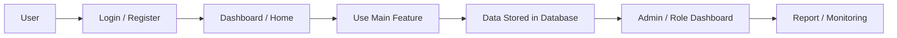

# Project Portfolio Documentation

---

# Bahasa Indonesia

## Nama Project

RentEase

---

## Deskripsi

RentEase adalah aplikasi web marketplace rental berbasis Laravel Blade. Aplikasi ini mendukung customer untuk mencari produk rental, melihat detail, wishlist, checkout, melihat order, dan memberi rating, serta mendukung seller dan admin untuk mengelola produk, order, kategori, user, wilayah, role, dan membership.

Live Demo: https://rentease.iandev.my.id/login

---

## Masalah

Proses rental barang membutuhkan katalog produk, order, rating, wishlist, dan kontrol pengguna yang terstruktur. Tanpa sistem marketplace, customer sulit menemukan produk rental dan seller/admin sulit mengelola produk, status order, kategori, wilayah, serta keamanan interaksi pengguna.

---

## Goals

Membangun marketplace rental yang mempertemukan customer dan seller, menyediakan alur produk-detail-checkout-order-rating, serta menyediakan dashboard admin untuk data master dan seller tools untuk produk, order, dan blocking user.

---

## Impact / Result

- Membangun alur marketplace rental dari home, detail produk, wishlist, checkout, order, hingga rating.
- Menyediakan modul seller untuk produk, gambar produk, order, bulk update status, rating user, dan block user.
- Menyediakan modul admin untuk membership, kategori, role, wilayah, user, dan product.
- Menyediakan model dan migration untuk product, order, wishlist, rating product, rating user, thread, komentar, like, dan user block.
- Menggunakan Intervention Image untuk pengolahan gambar produk.

---

## Fitur Utama

### Customer
- Registrasi dan login melalui Laravel UI Auth.
- Home rental marketplace.
- Melihat detail produk.
- Wishlist produk.
- Checkout produk.
- Profil: overview, setting, rating, produk, blog, dan order.
- Melihat detail order.
- Memberi rating produk.

### Seller
- Manajemen produk rental.
- Upload/hapus gambar produk.
- Manajemen order seller.
- Bulk update status order.
- Rating user dari order.
- Block/blacklist user.

### Admin
- Manajemen membership.
- Manajemen kategori dan sub kategori.
- Manajemen role.
- Manajemen provinsi, kabupaten/kota, dan kecamatan.
- Manajemen user.
- Manajemen product.

---

## Teknologi

### Frontend
- Blade views
- Bootstrap 5
- Tailwind CSS
- Sass
- Vite
- Axios
### Backend
- Laravel 11
- PHP 8.2+
- Laravel UI
- Laravel Scout
- Intervention Image
### Database
- Laravel migrations
- Database driver not specified in inspected summary
### Tools / Others
- Composer
- npm
- PHPUnit
- Laravel Pint

---

## System Architecture

### Flow Sederhana

Customer → Login/Register → Home → Product Detail → Wishlist / Checkout → Order → Rating Product → Seller Manage Order → Admin Manage Master Data

### Diagram Mermaid

---

## Struktur Folder Penting

- `app/Http/Controllers` — controller fitur utama dan role pengguna.
- `app/Models` — model entity database.
- `database/migrations` — schema database Laravel.
- `resources/js/pages` atau `resources/views` — halaman frontend.
- `routes/web.php` — route web utama.
- `routes/api.php` — route API jika tersedia.
- `composer.json` — dependency backend PHP/Laravel.
- `package.json` — dependency frontend dan build tool.

---

## Database / Entity Utama

- User
- Role
- Membership
- Kategori
- SubKategori
- Provinsi
- Kota
- Kecamatan
- Product
- ProductImage
- Order
- Wishlist
- RatingProduct
- RatingUser
- UserBlock
- Thread
- ThreadImage
- Komentar
- Like

---

## Integrasi / API Eksternal

Intervention Image ditemukan untuk pengolahan gambar. Payment/shipping API tidak ditemukan di repository.

---

## Informasi Tidak Ditemukan

- requirements.txt: Tidak ditemukan di repository.
- Dokumentasi deployment production khusus: Tidak ditemukan di repository.
- Data bisnis nyata seperti jumlah user, revenue, conversion rate, atau metrik performa: Tidak ditemukan di repository.

---

# English

## Project Name

RentEase

---

## Description

RentEase is a Laravel Blade-based rental marketplace web application. It supports customers in finding rental products, viewing details, wishlisting, checkout, viewing orders, and submitting ratings, while supporting sellers and admins in managing products, orders, categories, users, regions, roles, and memberships.

Live Demo: https://rentease.iandev.my.id/login

---

## Problem

Product rental needs structured catalog, order, rating, wishlist, and user control. Without a marketplace system, customers struggle to find rental products and sellers/admins struggle to manage products, order status, categories, regions, and user interaction safety.

---

## Goals

Build a rental marketplace that connects customers and sellers, provides product-detail-checkout-order-rating flow, and provides admin dashboard for master data plus seller tools for products, orders, and user blocking.

---

## Impact / Result

- Built rental marketplace flow from home, product detail, wishlist, checkout, order, to rating.
- Provided seller modules for products, product images, orders, bulk status updates, user rating, and user blocking.
- Provided admin modules for membership, categories, roles, regions, users, and products.
- Provided models and migrations for products, orders, wishlists, product ratings, user ratings, threads, comments, likes, and user blocks.
- Used Intervention Image for product image processing.

---

## Main Features

### Customer
- Registrasi dan login melalui Laravel UI Auth.
- Home rental marketplace.
- View detail produk.
- Wishlist produk.
- Checkout produk.
- Profil: overview, setting, rating, produk, blog, dan order.
- View detail order.
- Submit rating produk.

### Seller
- Manage produk rental.
- Upload/hapus gambar produk.
- Manage order seller.
- Bulk update status order.
- Rating user dari order.
- Block/blacklist user.

### Admin
- Manage membership.
- Manage kategori dan sub kategori.
- Manage role.
- Manage provinsi, kabupaten/kota, dan kecamatan.
- Manage user.
- Manage product.

---

## Technologies

### Frontend
- Blade views
- Bootstrap 5
- Tailwind CSS
- Sass
- Vite
- Axios
### Backend
- Laravel 11
- PHP 8.2+
- Laravel UI
- Laravel Scout
- Intervention Image
### Database
- Laravel migrations
- Database driver not specified in inspected summary
### Tools / Others
- Composer
- npm
- PHPUnit
- Laravel Pint

---

## System Architecture

### Simple Flow

Customer → Login/Register → Home → Product Detail → Wishlist / Checkout → Order → Product Rating → Seller Manage Order → Admin Manage Master Data

### Mermaid Diagram

---

## Important Folder Structure

- `app/Http/Controllers` — main feature and user role controllers.
- `app/Models` — database entity models.
- `database/migrations` — Laravel database schema.
- `resources/js/pages` or `resources/views` — frontend pages.
- `routes/web.php` — main web routes.
- `routes/api.php` — API routes if available.
- `composer.json` — PHP/Laravel backend dependencies.
- `package.json` — frontend dependencies and build tools.

---

## Database / Main Entities

- User
- Role
- Membership
- Kategori
- SubKategori
- Provinsi
- Kota
- Kecamatan
- Product
- ProductImage
- Order
- Wishlist
- RatingProduct
- RatingUser
- UserBlock
- Thread
- ThreadImage
- Komentar
- Like

---

## External Integrations / API

Intervention Image was found for image processing. Payment/shipping API was not found in the repository.

---

## Information Not Found

- requirements.txt: Not found in the repository.
- Dedicated production deployment documentation: Not found in the repository.
- Real business data such as user count, revenue, conversion rate, or performance metrics: Not found in the repository.
