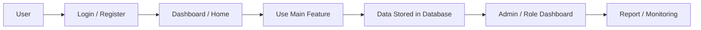

# Project Portfolio Documentation

---

# Bahasa Indonesia

## Nama Project

Simkesia / SIMKES

---

## Deskripsi

Simkesia / SIMKES adalah aplikasi web sistem informasi kesehatan berbasis Laravel, Inertia, dan React. Aplikasi ini mendukung pasien, petugas, admin faskes, dan superadmin untuk mengelola data keluarga, anak, kehamilan, pemeriksaan, konsultasi online, faskes, jadwal, dan data stunting.

Live Demo: https://simkesia.iandev.my.id/

---

## Masalah

Layanan kesehatan ibu dan anak membutuhkan pencatatan riwayat medis, pemeriksaan, jadwal petugas, konsultasi, dan data faskes yang rapi. Tanpa sistem terpusat, monitoring pasien, pemeriksaan ANC/anak, dan data stunting sulit dilakukan secara konsisten.

---

## Goals

Membangun sistem informasi kesehatan untuk membantu pasien memantau data keluarga, anak, kehamilan, konsultasi, dan faskes, serta membantu petugas/admin mengelola pemeriksaan, jadwal, konsultasi, faskes, dan data stunting.

---

## Impact / Result

- Membangun modul pasien untuk keluarga, anak, kehamilan, riwayat medis, grafik, panduan, konsultasi, faskes, dan bank obat.
- Menyediakan modul petugas untuk pemeriksaan anak, pemeriksaan kehamilan/ANC, riwayat, jadwal, dan konsultasi online.
- Menyediakan dashboard admin faskes untuk jadwal ketersediaan, petugas, dan pasien.
- Menyediakan superadmin untuk faskes, user faskes, wilayah, dan data stunting.
- Menyediakan API login Sanctum dan endpoint pemeriksaan anak/kehamilan.

---

## Fitur Utama

### Pasien
- Login/register dan profil pasien.
- Dashboard pasien.
- Kelola keluarga dan anggota keluarga.
- Data anak dan data kehamilan.
- Riwayat medis user.
- Riwayat pemeriksaan anak dan kehamilan.
- Grafik anak dan grafik kehamilan.
- Panduan pregnancy dan toddler.
- Cari faskes, detail faskes, dan peta faskes.
- Konsultasi online dan detail konsultasi.
- Chatbot kesehatan.
- Bank obat dan detail obat.

### Petugas
- Dashboard petugas.
- Pemeriksaan ANC/kehamilan.
- Pemeriksaan anak.
- Riwayat pemeriksaan.
- Konsultasi online, list konsultasi, dan room meet.
- Jadwal ketersediaan.
- Profil petugas.

### Admin Faskes
- Dashboard admin faskes.
- Manajemen jadwal ketersediaan.
- Manajemen petugas.
- Data pasien faskes.

### Superadmin
- Dashboard superadmin.
- Manajemen faskes.
- Manajemen user faskes.
- Manajemen provinsi, kota, kecamatan.
- Data stunting.

---

## Teknologi

### Frontend
- React 18
- TypeScript
- Inertia.js React
- Tailwind CSS
- Vite
- Radix UI
- Axios
- Jitsi Meet types
### Backend
- Laravel 12
- PHP 8.2+
- Laravel Breeze
- Laravel Sanctum
- Laravel Telescope
- Tighten Ziggy
### Database
- Laravel migrations
- Database driver not specified in inspected summary
### Tools / Others
- Composer
- npm
- PHPUnit
- Laravel Pint
- ESLint
- Prettier

---

## System Architecture

### Flow Sederhana

Pasien → Login/Register → Dashboard → Kelola Keluarga/Anak/Kehamilan → Konsultasi / Faskes / Riwayat → Petugas Pemeriksaan → Admin Faskes Jadwal & Petugas → Superadmin Data Faskes & Stunting

### Diagram Mermaid

---

## Struktur Folder Penting

- `app/Http/Controllers` — controller fitur utama dan role pengguna.
- `app/Models` — model entity database.
- `database/migrations` — schema database Laravel.
- `resources/js/pages` atau `resources/views` — halaman frontend.
- `routes/web.php` — route web utama.
- `routes/api.php` — route API jika tersedia.
- `composer.json` — dependency backend PHP/Laravel.
- `package.json` — dependency frontend dan build tool.

---

## Database / Entity Utama

- User
- Faskes
- Provinsi
- Kota
- Kecamatan
- Keluarga
- KeluargaAnggota
- Anak
- Kehamilan
- Kelahiran
- DataJanin
- PemeriksaanAnak
- PemeriksaanAnc
- MediaPemeriksaan
- MediaPemeriksaanAnak
- HasilLab
- RiwayatMedisUser
- RiwayatKehamilan
- RiwayatImunisasi
- RiwayatImunisasiAnak
- RiwayatSakitAnak
- RiwayatSakitKehamilan
- RiwayatObatAnak
- SkriningPerkembangan
- SesiKonsultasi
- JadwalKetersediaan
- JadwalNotifikasi
- LanggananFaskes
- ObatMaster
- ResepObatCheckup
- Notifikasi
- ChatLog
- ChatSource

---

## Integrasi / API Eksternal

Jitsi Meet types dan ChatBotController ditemukan di repository. Integrasi eksternal lain tidak ditemukan di repository.

---

## Informasi Tidak Ditemukan

- requirements.txt: Tidak ditemukan di repository.
- Dokumentasi deployment production khusus: Tidak ditemukan di repository.
- Data bisnis nyata seperti jumlah user, revenue, conversion rate, atau metrik performa: Tidak ditemukan di repository.

---

# English

## Project Name

Simkesia / SIMKES

---

## Description

Simkesia / SIMKES is a health information web application built with Laravel, Inertia, and React. It supports patients, health workers, facility admins, and superadmins in managing family data, children, pregnancies, checkups, online consultations, health facilities, schedules, and stunting data.

Live Demo: https://simkesia.iandev.my.id/

---

## Problem

Maternal and child health services need organized medical history, checkup records, schedules, consultations, and facility data. Without a centralized system, patient monitoring, ANC/child checkups, and stunting data are difficult to manage consistently.

---

## Goals

Build a health information system that helps patients manage family, child, pregnancy, consultation, and facility data, while helping workers/admins manage checkups, schedules, consultations, facilities, and stunting data.

---

## Impact / Result

- Built patient modules for family, children, pregnancy, medical history, charts, guides, consultations, facilities, and medicine bank.
- Provided health worker modules for child checkups, pregnancy/ANC checkups, history, schedules, and online consultations.
- Provided facility admin dashboard for availability schedules, workers, and patients.
- Provided superadmin modules for facilities, facility users, regions, and stunting data.
- Provided Sanctum login API and child/pregnancy checkup endpoints.

---

## Main Features

### Patient
- Login/register dan profil pasien.
- Dashboard pasien.
- Kelola keluarga dan anggota keluarga.
- Data anak dan data kehamilan.
- Riwayat medis user.
- Riwayat pemeriksaan anak dan kehamilan.
- Grafik anak dan grafik kehamilan.
- Panduan pregnancy dan toddler.
- Cari faskes, detail faskes, dan peta faskes.
- Konsultasi online dan detail konsultasi.
- Chatbot kesehatan.
- Bank obat dan detail obat.

### Health Worker
- Dashboard petugas.
- Pemeriksaan ANC/kehamilan.
- Pemeriksaan anak.
- Riwayat pemeriksaan.
- Konsultasi online, list konsultasi, dan room meet.
- Jadwal ketersediaan.
- Profil petugas.

### Admin Faskes
- Dashboard admin faskes.
- Manage jadwal ketersediaan.
- Manage petugas.
- Data pasien faskes.

### Superadmin
- Dashboard superadmin.
- Manage faskes.
- Manage user faskes.
- Manage provinsi, kota, kecamatan.
- Data stunting.

---

## Technologies

### Frontend
- React 18
- TypeScript
- Inertia.js React
- Tailwind CSS
- Vite
- Radix UI
- Axios
- Jitsi Meet types
### Backend
- Laravel 12
- PHP 8.2+
- Laravel Breeze
- Laravel Sanctum
- Laravel Telescope
- Tighten Ziggy
### Database
- Laravel migrations
- Database driver not specified in inspected summary
### Tools / Others
- Composer
- npm
- PHPUnit
- Laravel Pint
- ESLint
- Prettier

---

## System Architecture

### Simple Flow

Patient → Login/Register → Dashboard → Manage Family/Child/Pregnancy → Consultation / Facility / History → Worker Checkup → Facility Admin Schedules & Workers → Superadmin Facility & Stunting Data

### Mermaid Diagram

---

## Important Folder Structure

- `app/Http/Controllers` — main feature and user role controllers.
- `app/Models` — database entity models.
- `database/migrations` — Laravel database schema.
- `resources/js/pages` or `resources/views` — frontend pages.
- `routes/web.php` — main web routes.
- `routes/api.php` — API routes if available.
- `composer.json` — PHP/Laravel backend dependencies.
- `package.json` — frontend dependencies and build tools.

---

## Database / Main Entities

- User
- Faskes
- Provinsi
- Kota
- Kecamatan
- Keluarga
- KeluargaAnggota
- Anak
- Kehamilan
- Kelahiran
- DataJanin
- PemeriksaanAnak
- PemeriksaanAnc
- MediaPemeriksaan
- MediaPemeriksaanAnak
- HasilLab
- RiwayatMedisUser
- RiwayatKehamilan
- RiwayatImunisasi
- RiwayatImunisasiAnak
- RiwayatSakitAnak
- RiwayatSakitKehamilan
- RiwayatObatAnak
- SkriningPerkembangan
- SesiKonsultasi
- JadwalKetersediaan
- JadwalNotifikasi
- LanggananFaskes
- ObatMaster
- ResepObatCheckup
- Notifikasi
- ChatLog
- ChatSource

---

## External Integrations / API

Jitsi Meet types and ChatBotController were found in the repository. Other external integrations were not found in the repository.

---

## Information Not Found

- requirements.txt: Not found in the repository.
- Dedicated production deployment documentation: Not found in the repository.
- Real business data such as user count, revenue, conversion rate, or performance metrics: Not found in the repository.
