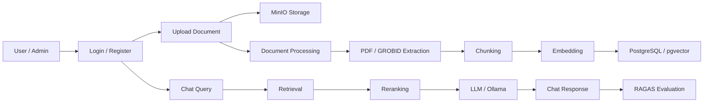

# Project Portfolio Documentation

---

# Bahasa Indonesia

## Nama Project

SyntraFix

---

## Deskripsi

SyntraFix adalah aplikasi chatbot RAG untuk penyimpanan dokumen jurnal ilmiah dan tanya jawab berbasis dokumen. Repository berisi backend FastAPI dan frontend React untuk autentikasi, manajemen dokumen, pemrosesan dokumen, chat, dashboard admin, user management, dan evaluasi RAGAS.

Backend memproses PDF/dokumen menggunakan layanan ekstraksi, chunking, embedding, retrieval, reranking, LLM, GROBID, MinIO, PostgreSQL/pgvector, Celery, dan Ollama/LangChain. Frontend menyediakan landing page, login/register, protected routes, admin dashboard, document upload/process/list/edit, user table, dan chat interface.

---

## Masalah

Pencarian informasi di jurnal ilmiah manual membutuhkan waktu lama, terutama ketika dokumen banyak dan informasi tersebar dalam PDF. Tim juga membutuhkan sistem untuk mengunggah, memproses, menyimpan, mengindeks, mencari, dan mengevaluasi kualitas jawaban RAG secara terstruktur.

---

## Goals

Tujuan project ini adalah membangun platform RAG berbasis web yang dapat mengelola dokumen ilmiah, mengekstrak dan memecah konten menjadi chunks, membuat embedding, menyimpan file di object storage, menjalankan chat berbasis retrieval, serta menyediakan dashboard admin dan tools evaluasi RAGAS.

---

## Impact / Result

- Membangun backend FastAPI untuk auth, documents, chats, dan prompt search.
- Membangun frontend React untuk landing page, login/register, dashboard admin, document management, user management, dan chat.
- Menyediakan pipeline upload dan pemrosesan dokumen dengan extraction, chunking, embedding, dan storage.
- Menggunakan PostgreSQL/pgvector untuk penyimpanan embedding dan pencarian vektor.
- Menggunakan MinIO untuk object storage dokumen.
- Menyediakan integrasi GROBID/PDF parsing untuk dokumen ilmiah.
- Menyediakan layanan retrieval, reranker, query expansion/question generator, prompt search, dan RAGAS evaluation.
- Menyediakan WebSocket untuk komunikasi real-time/chat.

---

## Fitur Utama

### User

- Register dan login.
- Protected routes untuk user yang sudah autentikasi.
- Chat dengan sistem RAG berbasis dokumen.
- Membuat chat baru dan melihat detail chat.

### Admin

- Admin route protection.
- Dashboard admin.
- Manajemen user: list user, table, columns, statistik user.
- Manajemen dokumen: list, create/upload, edit, process document.
- Upload file dokumen dan melihat daftar file terunggah.
- Edit document chunks.
- Melihat statistik dokumen dan tabel proses dokumen.

### Sistem RAG / Backend

- REST API FastAPI untuk auth, documents, chats, dan prompt search.
- WebSocket support.
- Upload dan storage dokumen melalui MinIO.
- PDF/document extraction dengan PyPDF, PyMuPDF, GROBID, dan parser XML.
- Chunking dokumen dan penyimpanan document chunks.
- Embedding menggunakan pgvector.
- Retrieval dan reranking.
- LLM service dan LangChain Ollama.
- Question generator dan prompt search.
- RAGAS export/evaluation.
- Celery task untuk document processing.
- Alembic migration untuk schema database.

---

## Teknologi

### Frontend

- React 19
- TypeScript
- Vite
- React Router / React Router DOM
- TanStack React Query
- TanStack React Table
- Tailwind CSS 4
- Radix UI / shadcn components
- Recharts
- Sonner
- Zod
- js-cookie

### Backend

- FastAPI
- Python
- SQLAlchemy
- Alembic
- Pydantic Settings
- python-jose
- bcrypt
- Celery
- WebSocket

### Database / Storage

- PostgreSQL
- pgvector
- MinIO

### AI / Document Processing

- LangChain Ollama
- Ollama
- GROBID
- PyPDF
- PyMuPDF
- lxml
- Google Generative AI
- RAGAS
- pandas
- datasets

### Testing / Quality

- pytest
- pytest-asyncio
- httpx
- ESLint
- TypeScript build

### Deployment / Dev Tools

- Vite build
- FastAPI standard runner
- Alembic migration
- Deployment configuration khusus: Tidak ditemukan di repository

---

## System Architecture

### Flow Sederhana

User/Admin → Login/Register → Upload Document → Store File in MinIO → Extract PDF/GROBID → Chunk Document → Generate Embeddings → Store in PostgreSQL/pgvector → User Chat Query → Retrieval/Reranking → LLM Answer → Chat Response → RAGAS Evaluation

### Diagram Mermaid



---

## Struktur Repository

```text
FastAPI/
  app/
    api/routes
    models
    schemas
    services
    tasks
    utils
  alembic/versions
  tests
  requirements.txt
syntra-frontend/
  src/
    pages/admin
    pages/auth
    pages/chat
    components
    lib/auth
    hooks
    styles
  package.json
ragas/
  data
  evaluate
  ragas.py
schema.sql
```

---

## Database Schema Ringkas

- `users`: data user dan role.
- `documents`: metadata dokumen, status processing, progress, dan informasi file.
- `document_chunks`: potongan dokumen, chunk type, embedding, dan metadata.
- `chats`: sesi chat.
- `chat_messages`: pesan chat.
- Detail schema lengkap: sebagian ditemukan melalui model SQLAlchemy dan Alembic; ringkasan schema SQL tersedia di `schema.sql`.

---

## Authentication & Authorization

Backend menyediakan route auth dan security utilities berbasis token/JWT dengan `python-jose` dan bcrypt. Frontend memiliki `authService`, `ProtectedRoute`, dan `AdminRoute`. Detail konfigurasi production auth: Tidak ditemukan di repository.

---

## Integrasi API

- MinIO object storage.
- PostgreSQL/pgvector.
- GROBID service.
- Ollama via LangChain Ollama.
- Google Generative AI dependency tersedia.
- Payment gateway: Tidak ditemukan di repository.
- Shipping integration: Tidak ditemukan di repository.
- Live Demo URL: Tidak ditemukan di repository.

---

# English

## Project Name

SyntraFix

---

## Description

SyntraFix is a RAG chatbot application for scientific journal document storage and document-based question answering. Repository contains FastAPI backend and React frontend for authentication, document management, document processing, chat, admin dashboard, user management, and RAGAS evaluation.

Backend processes PDF/documents through extraction, chunking, embedding, retrieval, reranking, LLM, GROBID, MinIO, PostgreSQL/pgvector, Celery, and Ollama/LangChain services. Frontend provides landing page, login/register, protected routes, admin dashboard, document upload/process/list/edit, user table, and chat interface.

---

## Problem

Manual information search across scientific journals takes time, especially when documents are numerous and information is scattered across PDFs. Teams also need structured system to upload, process, store, index, search, and evaluate RAG answer quality.

---

## Goals

Goal of this project is to build web-based RAG platform that manages scientific documents, extracts and chunks content, generates embeddings, stores files in object storage, runs retrieval-based chat, and provides admin dashboard plus RAGAS evaluation tools.

---

## Impact / Result

- Built FastAPI backend for auth, documents, chats, and prompt search.
- Built React frontend for landing page, login/register, admin dashboard, document management, user management, and chat.
- Provided document upload and processing pipeline with extraction, chunking, embedding, and storage.
- Used PostgreSQL/pgvector for embedding storage and vector search.
- Used MinIO for document object storage.
- Provided GROBID/PDF parsing integration for scientific documents.
- Provided retrieval, reranker, query expansion/question generator, prompt search, and RAGAS evaluation services.
- Added WebSocket support for real-time/chat communication.

---

## Key Features

### User

- Register and login.
- Protected routes for authenticated users.
- Chat with document-based RAG system.
- Create new chat and view chat details.

### Admin

- Admin route protection.
- Admin dashboard.
- User management: user list, table, columns, user statistics.
- Document management: list, create/upload, edit, process document.
- Upload document files and view uploaded files list.
- Edit document chunks.
- View document statistics and document processing table.

### RAG System / Backend

- FastAPI REST API for auth, documents, chats, and prompt search.
- WebSocket support.
- Document upload and storage through MinIO.
- PDF/document extraction with PyPDF, PyMuPDF, GROBID, and XML parser.
- Document chunking and document chunk storage.
- Embeddings with pgvector.
- Retrieval and reranking.
- LLM service and LangChain Ollama.
- Question generator and prompt search.
- RAGAS export/evaluation.
- Celery task for document processing.
- Alembic migrations for database schema.

---

## Technology

### Frontend

- React 19
- TypeScript
- Vite
- React Router / React Router DOM
- TanStack React Query
- TanStack React Table
- Tailwind CSS 4
- Radix UI / shadcn components
- Recharts
- Sonner
- Zod
- js-cookie

### Backend

- FastAPI
- Python
- SQLAlchemy
- Alembic
- Pydantic Settings
- python-jose
- bcrypt
- Celery
- WebSocket

### Database / Storage

- PostgreSQL
- pgvector
- MinIO

### AI / Document Processing

- LangChain Ollama
- Ollama
- GROBID
- PyPDF
- PyMuPDF
- lxml
- Google Generative AI
- RAGAS
- pandas
- datasets

### Testing / Quality

- pytest
- pytest-asyncio
- httpx
- ESLint
- TypeScript build

### Deployment / Dev Tools

- Vite build
- FastAPI standard runner
- Alembic migration
- Specific deployment configuration: Not found in the repository

---

## System Architecture

### Simple Flow

User/Admin → Login/Register → Upload Document → Store File in MinIO → Extract PDF/GROBID → Chunk Document → Generate Embeddings → Store in PostgreSQL/pgvector → User Chat Query → Retrieval/Reranking → LLM Answer → Chat Response → RAGAS Evaluation

### Mermaid Diagram


---

## Repository Structure

```text
FastAPI/
  app/
    api/routes
    models
    schemas
    services
    tasks
    utils
  alembic/versions
  tests
  requirements.txt
syntra-frontend/
  src/
    pages/admin
    pages/auth
    pages/chat
    components
    lib/auth
    hooks
    styles
  package.json
ragas/
  data
  evaluate
  ragas.py
schema.sql
```

---

## Database Schema Summary

- `users`: user data and role.
- `documents`: document metadata, processing status, progress, and file information.
- `document_chunks`: document chunks, chunk type, embedding, and metadata.
- `chats`: chat sessions.
- `chat_messages`: chat messages.
- Full schema details: partially found through SQLAlchemy models and Alembic; schema summary SQL exists in `schema.sql`.

---

## Authentication & Authorization

Backend provides auth routes and token/JWT security utilities using `python-jose` and bcrypt. Frontend has `authService`, `ProtectedRoute`, and `AdminRoute`. Production auth configuration details: Not found in the repository.

---

## API Integrations

- MinIO object storage.
- PostgreSQL/pgvector.
- GROBID service.
- Ollama via LangChain Ollama.
- Google Generative AI dependency exists.
- Payment gateway: Not found in the repository.
- Shipping integration: Not found in the repository.
- Live Demo URL: Not found in the repository.
