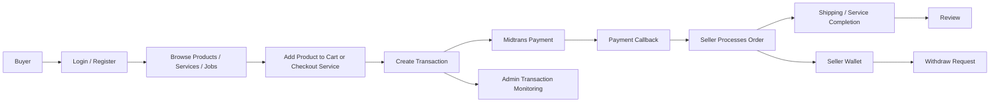

# Project Portfolio Documentation

---

# Bahasa Indonesia

## Nama Project

WargaUsaha

---

## Deskripsi

WargaUsaha adalah aplikasi marketplace berbasis Laravel untuk mendukung transaksi produk, layanan, dan lowongan kerja antar warga/pelaku usaha. Aplikasi digunakan oleh Buyer/Customer, Seller, Employer, dan Admin.

Sistem menyediakan katalog produk dan layanan, keranjang belanja, checkout, pembayaran Midtrans, manajemen toko/mart, wallet seller, withdraw, review, chat/message, pendaftaran mart, serta modul lowongan kerja dan pelamar.

---

## Masalah

Pelaku usaha lokal membutuhkan platform terpadu untuk menjual produk dan jasa, menerima pesanan, mengelola pembayaran, dan berinteraksi dengan pelanggan. Tanpa sistem terpusat, proses transaksi, validasi toko, pengiriman, pembayaran, dan pencatatan wallet sulit dipantau secara rapi.

---

## Goals

Tujuan project ini adalah membangun marketplace warga yang menghubungkan pembeli, penjual, dan pemberi kerja dalam satu aplikasi, dengan alur registrasi toko, katalog produk/jasa, checkout, pembayaran online, pengelolaan transaksi, wallet seller, withdraw, chat, review, dan lowongan kerja.

---

## Impact / Result

- Membangun marketplace multi-role untuk Buyer, Seller, Employer, dan Admin.
- Menyediakan alur belanja produk dari katalog, cart, checkout, pembayaran, hingga transaksi selesai.
- Menyediakan alur pemesanan layanan dan konfirmasi order layanan oleh seller.
- Mengintegrasikan Midtrans untuk pembayaran dan webhook callback status transaksi.
- Menyediakan wallet seller, log wallet, dan proses withdraw.
- Menyediakan modul pendaftaran mart yang dapat diterima atau ditolak admin.
- Menyediakan chat/message, review, dan notifikasi WhatsApp job.
- Menambahkan modul lowongan kerja dan pelamar kerja.

---

## Fitur Utama

### Buyer / Customer

- Register, login, logout, reset password, dan profile management.
- Melihat produk, layanan, seller, mart, dan lowongan kerja.
- Detail produk, layanan, seller, dan lowongan kerja.
- Menambahkan produk ke cart.
- Checkout cart dengan grouping order per mart.
- Checkout layanan.
- Melihat transaksi dan detail transaksi.
- Membayar transaksi dengan Midtrans.
- Membatalkan transaksi.
- Menyelesaikan order.
- Memberikan review.
- Chat/message dengan user lain.
- Mendaftar sebagai mart/seller.
- Melamar lowongan kerja.

### Seller

- Mengelola profile seller.
- Mengelola mart, status aktif/nonaktif mart, dan setting mart.
- CRUD produk.
- CRUD layanan.
- Melihat order produk dan order layanan.
- Menerima atau menolak order layanan.
- Mengubah status pengiriman order produk.
- Mengelola wallet.
- Mengajukan withdraw.

### Employer

- Mengelola profile.
- CRUD lowongan kerja.
- Mengubah status lowongan kerja.
- Mengelola pelamar kerja.

### Admin

- Dashboard/admin area dengan middleware `admin`.
- Manajemen mart.
- Manajemen user.
- Manajemen produk.
- Manajemen layanan.
- Manajemen transaksi.
- Manajemen withdraw.
- Verifikasi pendaftaran mart: accept/reject.

---

## Teknologi

### Frontend

- Blade Views
- Livewire
- Alpine.js
- Tailwind CSS
- Vite
- Axios
- Lodash

### Backend

- Laravel 12
- PHP 8.2+
- Laravel Breeze
- Laravel Sanctum
- Laravel Queue / Jobs

### Database

- Relational database via Laravel migrations
- Tabel utama: users, marts, mart_categories, products, product_categories, services, service_categories, carts, transactions, group_orders, orders, reviews, messages, seller_wallets, log_wallets, job_vacancies, job_applications, subdistricts, wards, personal_access_tokens, jobs, cache
- Jenis database spesifik: Tidak ditemukan di repository

### Integrasi

- Midtrans payment gateway
- WhatsApp notification job
- Ongkir/shipping cost check service (`CekOngkirSerivce`)

### Testing / Quality

- Pest PHP
- Laravel Pint
- Laravel Sail

### Deployment / Dev Tools

- Composer
- npm
- Vite build
- Laravel artisan serve
- Deployment configuration khusus: Tidak ditemukan di repository

---

## System Architecture

### Flow Sederhana

Buyer → Login/Register → Browse Product/Service/Seller → Add to Cart / Checkout Service → Checkout → Midtrans Payment → Payment Callback → Order Processed by Seller → Shipping / Service Completion → Review → Admin Monitors Transactions

### Diagram Mermaid



---

## Struktur Repository

```text
app/
  Http/Controllers/Admin
  Http/Controllers/Customer
  Http/Controllers/Seller
  Http/Controllers/Employer
  Models
  Services
  Jobs
database/
  migrations
  seeders
resources/
  views
  js
  css
routes/
  web.php
  api.php
  auth.php
config/
```

---

## Authentication & Authorization

Aplikasi memakai Laravel Breeze untuk autentikasi. Route admin memakai middleware `auth` dan `admin`. Root route mengarahkan user berdasarkan `role` (`Seller` atau `Buyer`) dan `is_admin`. Role Employer tersedia melalui prefix route `employer`.

---

## Integrasi API

- Midtrans digunakan untuk pembayaran, snap token, callback webhook, signature validation, dan update status transaksi.
- API callback payment tersedia di `routes/api.php`.
- Endpoint cek ongkir tersedia di `POST /api/cekOngkir`.
- Payment/shipping lain: Tidak ditemukan di repository.

---

## Live Demo

https://wargausaha.iandev.my.id/login

---

# English

## Project Name

WargaUsaha

---

## Description

WargaUsaha is a Laravel-based marketplace application for local products, services, and job vacancies. Application is used by Buyer/Customer, Seller, Employer, and Admin roles.

System provides product and service catalogs, cart, checkout, Midtrans payment, mart/store management, seller wallet, withdrawals, reviews, chat/message, mart registration, and job vacancy/applicant modules.

---

## Problem

Local business owners need a centralized platform to sell products and services, receive orders, manage payments, and communicate with customers. Without centralized system, transactions, store validation, shipping, payments, and wallet records are harder to monitor cleanly.

---

## Goals

Goal of this project is to build a community marketplace connecting buyers, sellers, and employers in one application, with store registration, product/service catalog, checkout, online payment, transaction management, seller wallet, withdrawals, chat, reviews, and job vacancy features.

---

## Impact / Result

- Built multi-role marketplace for Buyer, Seller, Employer, and Admin.
- Added product shopping flow from catalog, cart, checkout, payment, to completed transaction.
- Added service order flow and seller-side service order confirmation.
- Integrated Midtrans for payment and transaction status webhook callback.
- Added seller wallet, wallet logs, and withdrawal process.
- Added mart registration module with admin accept/reject flow.
- Added chat/message, review, and WhatsApp notification job.
- Added job vacancy and applicant modules.

---

## Key Features

### Buyer / Customer

- Register, login, logout, reset password, and profile management.
- Browse products, services, sellers, marts, and job vacancies.
- View product, service, seller, and job vacancy details.
- Add products to cart.
- Checkout cart with order grouping per mart.
- Checkout services.
- View transactions and transaction details.
- Pay transactions with Midtrans.
- Cancel transactions.
- Complete orders.
- Submit reviews.
- Chat/message with other users.
- Register a mart/store.
- Apply for job vacancies.

### Seller

- Manage seller profile.
- Manage mart/store, active/inactive status, and settings.
- CRUD products.
- CRUD services.
- View product orders and service orders.
- Accept or reject service orders.
- Update product order shipping status.
- Manage wallet.
- Request withdrawal.

### Employer

- Manage profile.
- CRUD job vacancies.
- Update job vacancy status.
- Manage job applicants.

### Admin

- Admin area protected by `admin` middleware.
- Manage marts.
- Manage users.
- Manage products.
- Manage services.
- Manage transactions.
- Manage withdrawals.
- Verify mart registrations: accept/reject.

---

## Technology

### Frontend

- Blade Views
- Livewire
- Alpine.js
- Tailwind CSS
- Vite
- Axios
- Lodash

### Backend

- Laravel 12
- PHP 8.2+
- Laravel Breeze
- Laravel Sanctum
- Laravel Queue / Jobs

### Database

- Relational database via Laravel migrations
- Main tables: users, marts, mart_categories, products, product_categories, services, service_categories, carts, transactions, group_orders, orders, reviews, messages, seller_wallets, log_wallets, job_vacancies, job_applications, subdistricts, wards, personal_access_tokens, jobs, cache
- Specific database engine: Not found in the repository

### Integrations

- Midtrans payment gateway
- WhatsApp notification job
- Shipping cost check service (`CekOngkirSerivce`)

### Testing / Quality

- Pest PHP
- Laravel Pint
- Laravel Sail

### Deployment / Dev Tools

- Composer
- npm
- Vite build
- Laravel artisan serve
- Specific deployment configuration: Not found in the repository

---

## System Architecture

### Simple Flow

Buyer → Login/Register → Browse Product/Service/Seller → Add to Cart / Checkout Service → Checkout → Midtrans Payment → Payment Callback → Order Processed by Seller → Shipping / Service Completion → Review → Admin Monitors Transactions

### Mermaid Diagram


---

## Repository Structure

```text
app/
  Http/Controllers/Admin
  Http/Controllers/Customer
  Http/Controllers/Seller
  Http/Controllers/Employer
  Models
  Services
  Jobs
database/
  migrations
  seeders
resources/
  views
  js
  css
routes/
  web.php
  api.php
  auth.php
config/
```

---

## Authentication & Authorization

Application uses Laravel Breeze for authentication. Admin routes use `auth` and `admin` middleware. Root route redirects user based on `role` (`Seller` or `Buyer`) and `is_admin`. Employer role exists through `employer` route prefix.

---

## API Integrations

- Midtrans is used for payments, snap token, webhook callback, signature validation, and transaction status updates.
- Payment callback API exists in `routes/api.php`.
- Shipping cost check endpoint exists at `POST /api/cekOngkir`.
- Other payment/shipping integrations: Not found in the repository.

---

## Live Demo

https://wargausaha.iandev.my.id/login
